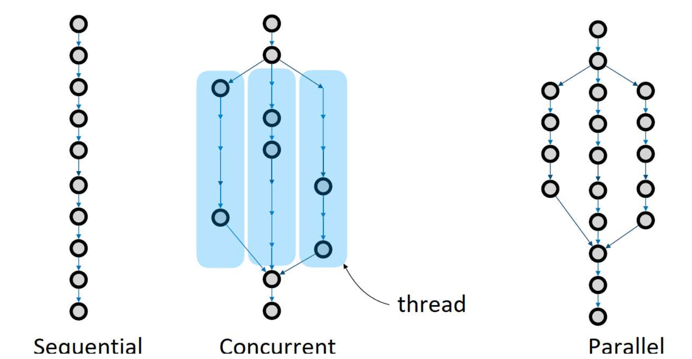
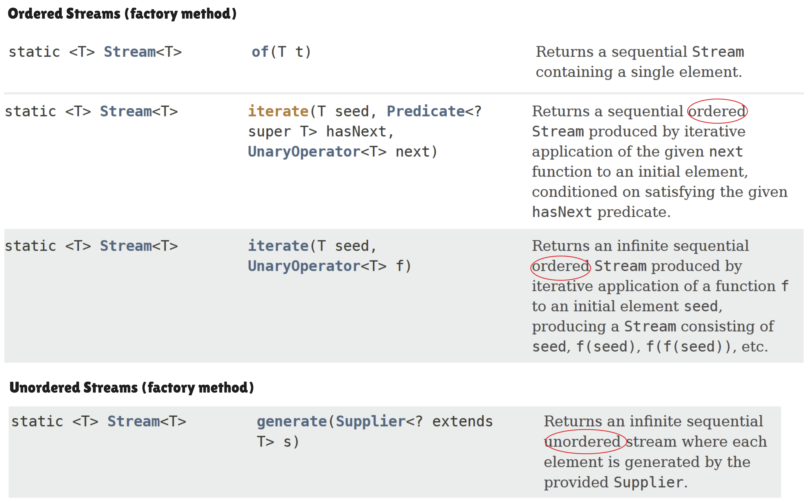
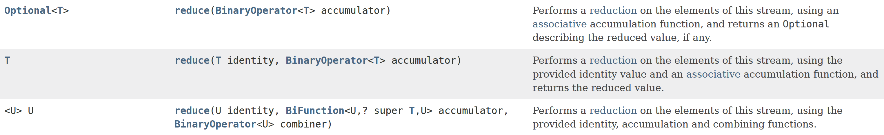

# Week 10 Lecture -- Parallel Streams
## Learning Outcomes
- stream pipeline should be **inherently parallel** $\implies$ must assume it is parallel
- streams are not only about looping, it is also about parallelizing tasks
	- Streams has an in-built parallel processing processing algorithm

- not every problem is to be solved with parallel solutions $\implies$ make use of parallel streams only when it is beneficial to do so

- need to keep in mind that we might be passed a parallel stream to work with
	- have certain considerations to take care of

- What are stateless operations and stateful operations
	- stateless operations suit streams very well
	- **stateless operations** -- independent elements that don't depend on each other
	- **stateful operations** -- elements are not created as independent, requires knowledge about neighboring elements

**What are non-interfering streams**
- do **not** have any s**ide effects and modification** on the other stream types

Looking at the `reduce()` terminal operation $\implies$ associative accumulation function
- accumulator and combiner rules

Appreciate the overhead of parallelizing tasks and what tasks that we should parallelize
- utilizing multi-cores of the machine

```java
jshell> ForkJoinPool.getCommonPoolParallelism()
$1 ==> 15
```

## Concurrency vs Parallelism
- single core machine executes *one process at one time*
- context switching allows for multi-tasking $\to$ single CPU core has multiple threads
	- each thread can delegate work to different tasks / instructions
	- we have threads that are spawned to work on individual tasks

- seems as if it is working in parallel, but it is not in actuality

**Concurrent Programs**
- Run concurrently using threads

**Parallel Computing**
- multiple subtasks running at the same time
- parallel programs are concurrent, but not all concurrent programs are parallel

### From Sequential to Parallel
- **Concurrent**: the OS is the one that switches between the threads
	- at any instance of time, there is only one thing that **one particular thread** is doing at a time



Level of Parallelism can be controlled using the `-D` flag.
```bash
$ java -Djava.util.concurrent.ForkJoinPool.common.parallelism=3 ...

$ jshell -R -Djava.util.concurrent.ForkJoinPool.common.parallelism=3 ...
```

- To "switch on" parallel, we use the `parallel()` method
	- can be anywhere **between the initial / source to the terminal operators**
		- the effect is exactly the same!
	- Streams are declarative and checks for parallelism in operations **only when** it reaches the **terminal operator**
	- There is a notion of **element order** $\to$ certain operations enable one to maintain the order, while others cannot
		- brings back the point of associative versus non-associative operations (where order may matter)

- To "switch off" parallel, we use the `sequential()` method
	- ⚠️ *Note:* never take a stream from others that has parallelism enabled and put `sequential()` $\implies$ turning off the parallelism, which does not make any sense



### Watching / Debugging Parallel Streams
- writing streams in parallel is not a predictable process (can't definitively tell which one will be done first)
- cannot control what is done when in parallel streams, but we still can debug these streams
- We can ***slow down the execution*** of the parallel stream using `Thread.sleep()`

```java
ForkJoinPool.getCommonPoolParallelism();
<T> T timed(T t) {
    try {
        System.out.println(t + " : " + Thread.currentThread().getName());
        Thread.sleep(500);
    } catch (InterruptedException ex) {}

    return t;
}
```

### Parallel Streams
- Streams are *inherently parallelizable*
- able to perform reduction of stream elements using a divide and conquer strategy (i.e. using the normal convention of left-reduction versus the other possibility of right-reduction $\to$ see recitation 09)
- can use `IntStream`s as well

```java
jshell> IntStream.
   ...> range(0, 10).
   ...> map(x -> timed(x)).
   ...> forEach(x -> System.out.println(x))
```

- using `Fork.JoinPool... = 3`, we can have **up to $4$ tasks running at once**

- we can speed up using the `parallel()` method call on the intermediate operation portions
	- see the output of the above entered below (we observe that the output is out of order)
```java
jshell> IntStream.range(0, 10).map(x -> timed(x)).forEach(x -> System.out.println(x));
0 : main
0
1 : main
1
2 : main
2
3 : main
3
4 : main
4
5 : main
5
6 : main
6
7 : main
7
8 : main
8
9 : main
9

jshell> IntStream.range(0, 10).map(x -> timed(x)).parallel().forEach(x -> System.out.println(x));
6 : main
2 : ForkJoinPool.commonPool-worker-1
1 : ForkJoinPool.commonPool-worker-2
4 : ForkJoinPool.commonPool-worker-3
3 : ForkJoinPool.commonPool-worker-6
9 : ForkJoinPool.commonPool-worker-7
7 : ForkJoinPool.commonPool-worker-5
8 : ForkJoinPool.commonPool-worker-4
5 : ForkJoinPool.commonPool-worker-8
0 : ForkJoinPool.commonPool-worker-9
8
0
4
1
6
5
2
9
7
3
```

#### `forEachOrdered()`
- during termination, elements are processed in **encounter order** (how the elements are ordered, as per with the source operation) $\to$ see output below
```java
jshell> IntStream.range(0, 10).map(x -> timed(x)).parallel().forEachOrdered(x -> System.out.println(x));
8 : ForkJoinPool.commonPool-worker-4
9 : ForkJoinPool.commonPool-worker-7
5 : ForkJoinPool.commonPool-worker-8
7 : ForkJoinPool.commonPool-worker-5
3 : ForkJoinPool.commonPool-worker-6
6 : main
2 : ForkJoinPool.commonPool-worker-1
1 : ForkJoinPool.commonPool-worker-2
4 : ForkJoinPool.commonPool-worker-3
0 : ForkJoinPool.commonPool-worker-9
0
1
2
3
4
5
6
7
8
9
```

## Stateless versus Stateful Operations
- *`map()`and `filter()`* are subjected to the same predicate and hence are **stateless intermediate operations**
	- ideal to have operations that are all stateless in the `Stream` itself $\implies$ try to make streams as stateless as possible
	- when we have all stateless operations, then no waiting is done.

- **Stateful** *intermediate operations* include *`sorted()`, `limit()`, `distinct()`*, which means that full parallelism is not exploited since there is some form of waiting
	- ***impedes the parallelism a little***, although still can be present, but may not be good practice
	- when using `sorted()`, we need to ensure that elements coming before it **have been already processed** before it processes the current element
		- how many came before me? what is the order thar can before me? is the one before me the same as me? (compare equality when sorting)

- the printing step needs to ensure that the elements are sorted

## Correctness of Streams
- in streams, nothing in the pipeline should change the source $\to$ **should not be using** mutable types like `ArrayList`
	- stream operations **must not** *interfere with stream data*

❌ ***A negative example***
```java
jshell> List<String> list = new ArrayList<String>((List.of("abc", "def", "xyz")))
list ==> [abc, def, xyz]

// attempting to change the source of the stream
jshell> list.stream().peek(str -> { if (str.equals("xyz")) list.add("pqr");}).forEach(x -> {});
|  Exception java.util.ConcurrentModificationException
```

- In streams, we would *prefer* operations to be stateless (i.e. using `map()` over `sorted()`) and **without any side effects**

```java
list.stream()
.parallel()
.filter(x -> isPrime(x))
.forEach(x -> result.add(x))
```

- if we have a **pipeline with a side effect**, we *could have an incorrect answer* (**not** a good thing since we want our results to be both *correct and deterministic*)
	- there might be instances where two process complete the computation and attempt to have their result added to `ArrayList`

- can resolve either by using `forEachOrdered()` or `toList()` (at the end to collect elements)
```java
boolean isPrime(int n) {
        return n > 1 && IntStream.range(2, n).noneMatch(x -> n % x == 0);
}

void foo() {
    List<Integer> list = List.of(1, 3, 5, 7, 9, 11, 13, 15, 17, 19);
    List<Integer> result = new ArrayList<Integer>();

    list.
        stream().
        parallel().
        filter(x -> isPrime(x)).
        // we first used forEach -> result in incorrectness
        forEachOrdered(x -> result.add(x));

    System.out.println(result);
}
```

- we can terminate with `toList()` instead of using `forEachOrdered()` (as it has *no side-effects*)
```java
boolean isPrime(int n) {
	return n > 1 && IntStream.range(2, n).noneMatch(x -> n % x == 0);
}

void foo() {
    List<Integer> list = List.of(1, 3, 5, 7, 9, 11, 13, 15, 17, 19);
    List<Integer> result = new ArrayList<Integer>();
	result = list.
		stream().
		parallel().
		filter(x -> isPrime(x)).
		toList();
        
    System.out.println(result);
}
```

---
## Association Accumulation Function
`reduce()` has 3 different possible types
1. reduce with an **identity and `BinaryOperator`** (final value is an aggregated `T` value)
	- is the most commonly seen and used
	- utilizing an **associative accumulation** function
		- should **not use** 

2. reduce with **no seed** (returns an `Optional<T>` $\implies$ when stream is empty, return `Optional.empty`)
	- quite rarely used
	- `reduce()` with the use of only a `BiFunction` or accumulator

3. reduce with an identity, a`BiFunction` and a `BinaryOperator` $\implies$ when we want to convert types, but we can do away with this
	- should be used only **when doing things in parallel**
	- ⚠️ not really good to use to convert types  (i.e. transform from element type to seed's type) $\implies$ **better practice to use `map()` instead** in this case




```java
jshell> /list reduceFunc
   1 : double reduceFunc(Stream<Double> st) {
           return st.reduce(24.0, (x, y) -> x / y);
       }

jshell> Stream<Double> s1 = Stream.<Double>of(1.0, 2.0, 3.0, 4.0);
s1 ==> java.util.stream.ReferencePipeline$Head@66480dd7

jshell> reduceFunc(s1)
$3 ==> 1.0
```

Have to ensure that the operation being performed is associative (i.e. addition, multiplication, function composition) when using th 3-argument `reduce()` HOF
```java
jshell> Stream.of(1.0, 2.0, 3.0, 4.0).
   ...> reduce(24.0, (x, y) -> x / y)
$4 ==> 1.0

jshell> Stream.of(1.0, 2.0, 3.0, 4.0).parallel().
   ...> reduce(24.0, (x, y) -> x / y)
$5 ==> 1.5
```
- sequential stream's result is *always correct* using the `reduce()` method
- parallel stream's result is wrong??? ==Streams are inherently parallel==
	- we **cannot assume** that the reduction is done nicely (`24/1`, then `24/2`, then `12/3`, then `4/4`) $\implies$ sequential execution from one to another to ensure correctness

- multiplication and addition is associative, but *division is not associative*!
	- this will affect the reduction (is not done from left to right)

- function compositions are also associative!
	- we can utilize this fact to wrap division to *enable it to be deterministic and correct*.

We need to be careful when picking portions of the stream in which we want to exploit parallelism
- use it for expensive operations

### The 2-argument reduce
```java
reduce(T identity, BinaryOperator<T> accumulator)
```

makes use of 
```java
<U> U reduce(U identity, BiFunction<U,? super T,U> accumulator, BinaryOperator<U> combiner)
```

#### Example of using 2 and 3 argument reduce in the same operation
```java
jshell> Stream.of("one", "two", "three").map(x -> x.length()).reduce(0, (x, y) -> x + y)
$1 ==> 11

jshell> Stream.of("one", "two", "three").reduce(0, (x, y) -> x + y.length(), (x, y) -> x + y)
$2 ==> 11

jshell> Stream.of("one", "two", "three").parallel().reduce(0, (x, y) -> x + y.length(), (x, y) -> x + y)
$3 ==> 11
```
Misusing the 3-argument reduce (**should not** do this way)!
- rather should be using `map()` $\implies$ see the first example
#### Stream
- The stream is partitioned for each worker to do the **accumulation and combining** in `reduce()`.
- The stream is partitioned as a **tree** where there are **no crossing lines** (to prevent double combining) $\implies$ there are *no overlapping lines*
```bash
$ jshell -R -Djava.util.concurrent.ForkJoinPool.common.parallelism=3 Timed.jsh
|  Welcome to JShell -- Version 21.0.4
|  For an introduction type: /help intro

jshell> /open timed.jsh

jshell> /list

   1 : ForkJoinPool.getCommonPoolParallelism();
   3 : ForkJoinPool.getCommonPoolParallelism();
   4 : <T> T timed(T t) {
           try {
               System.out.println(t + " : " + Thread.currentThread().getName());
               Thread.sleep(500);
           } catch (InterruptedException ex) {}

           return t;
       }

jshell> IntStream.range(0, 10).parallel().reduce(0, (x, y) -> timed(x + y))
8 : ForkJoinPool.commonPool-worker-2
2 : ForkJoinPool.commonPool-worker-1
6 : main
1 : ForkJoinPool.commonPool-worker-3

===

5 : main
4 : ForkJoinPool.commonPool-worker-1
9 : ForkJoinPool.commonPool-worker-2
0 : ForkJoinPool.commonPool-worker-3

===

11 : main
3 : ForkJoinPool.commonPool-worker-1
1 : ForkJoinPool.commonPool-worker-3
17 : ForkJoinPool.commonPool-worker-2

===

7 : ForkJoinPool.commonPool-worker-1
7 : ForkJoinPool.commonPool-worker-3
9 : ForkJoinPool.commonPool-worker-1
24 : ForkJoinPool.commonPool-worker-3
10 : ForkJoinPool.commonPool-worker-1
35 : ForkJoinPool.commonPool-worker-3
45 : ForkJoinPool.commonPool-worker-3
$5 ==> 45
```

## Accumulator and Combiner Rules
- don't perform typecasting within the combiner method
#### 1. Identity Rule
- identity are the **same type** that we are combining with (when using `reduce()`) $\implies$ take in **type `T` seed and type `T` values**
- the below code violates this rule!
```java
jshell> Stream.of("one", "two", "three").reduce(0, (x, y) -> x + y.length(), (x, y) -> x + y)
$2 ==> 11
```

- ❗`combiner.apply(identity, i)` **must equal** `i`.
	- is NOT `accumulator.apply(identity, i)` because accumulator takes in type `U` and type `T` elements to give a type `U` result.

- we may use an identity for accumulation in the case where there is no "initial value", thus having the need for a *seed value*.
	- there is a possibility that a value is **filtered out** and not combined with the rest of the elements
#### 2. Associativity of Accumulator and Combiner
- both the $Accumulator$ and the $Combiner$ should be associative (i.e. order of application does not matter) $\implies$ we do not specify which pair we should be combining first
- the below code violates this rule!
```java
jshell> Stream.of(1.0, 2.0, 3.0, 4.0).parallel().
   ...> reduce(24.0, (x, y) -> x / y, (x, y) -> x / y);
```

#### 3. Compatibility
- both the $Accumulator$ and the $Combiner$ should be compatible, meaning:
```java
// combiner takes in two U values to produce a single U value
combiner.apply(u, accumulator.apply(identity, t));

// MUST be equal to
accumulator.apply(u, t);
```
## Overhead of Parallelism
- time it takes to *handle or manage the threads* is taking much more overhead and time compared to just **running the trivial task itself**
	- parallelizing a trivial task takes more work in terms of overhead
	- only has benefit when it is a **heavy task** and is complex enough, so might not be advisable to use for trivial tasks

- have to identify the **correct task** to parallelize 
```java
import java.time.*;

boolean isPrime(int n) {
    return n > 1 && IntStream
		.range(2, (int) Math.sqrt(n))
		.parallel()
		// no make sense to parallelize division                      
		.noneMatch(x -> n % x == 0);
}

long numOfPrimes(int from, int to) {
    Instant start = Instant.now(); // start the timing

    long howMany = IntStream.rangeClosed(from, to)
        .parallel()
        .filter(x -> isPrime(x))
        .count();

    Instant stop = Instant.now(); // end the timing

    System.out.println("Duration: " + 
        Duration.between(start, stop).toMillis() + "ms");
    return howMany;
}
```