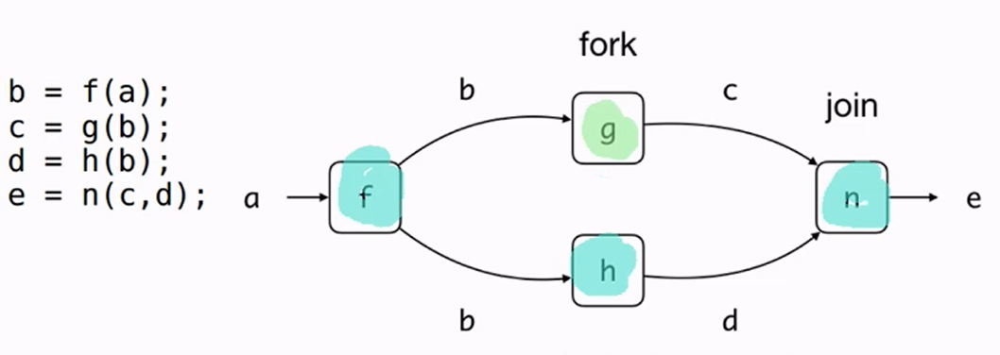

# Lecture 11 -- Asynchronous Programming
- more general $\implies$ different workers doing things, but each worker may not be doing the same thing (instead of multiple workers executing different instructions)

- we will take a look at promises (need some time)
	- Context of `CompletableFuture` will help us with async programming

We will look at async programs spawning others
- a process get spawned off to different processes and they need to be joined back into a single process
## Fork and Join
- the output value of `f()` will be passed to `g()` and `h()`.
	- we fork the task `g()` to execute in conjunction with `h()` and then join back task `g()` later on

- If `g()` and `h()` don't have side effects, they don't depend on any external states and do not modify external state
	- both `g()` and `h()` can work independent of each other but both require an argument of `b()`, **at the same time**

- the "extra task" spawned off another thread is `g()`, the main thread will do the `join()` operation



## Runnable
- runnable is a functional interface of thread and has an abstract method of `run()`
	- quite similar to Supplier's `get()`, as it takes in no arguments $\implies$ provides a value back
	- `run()` returns no value (i.e. `void`) 

- cannot be effect free in thread (need to change some external state via the `run()` lambda)


### `foo()`
- if `g()` takes a shorter time than `h()` and the main thread is waiting for `g()`, `g()` doesn't have to be a chance of returning
	- make use of `join()` to wait for all threads to finish

### Busy wait
- use `while (t.isAlive()){...}`
	- keep calling the method

- is not the right way (potentially can be doing other things)

### Blocking wait
- once the threat finishes, the thread should signal to us that it is done.
	- utilizing `t.join()`
	- prevent main thread from continue until a signal is sent back

## `CompletableFuture<T>`
- promises one a value, **if you want it later**

### Creation of a `CompletableFuture`
- We use the `supplyAsync()` static factory method to allow us to have threads spawned for a specific process
	- `supplyAsync()` is the wrapper for the context
	- takes in a Supplier $\implies$ make it such does the context can do another thing
	- spawn off process in a thread, the thread starts to process immediately (so no time is wasted)

```java
CompletableFuture.<B>supplyAsync(() -> f(new A(5)));
```

- another alternative method is `runAsync()` that takes in a Runnable

- can then issue `CompletableFuture.join()` method to wait for the thread to finish before continuing on

```java
CompletableFuture.<B>supplyAsync(() -> f(new A(5))).join();
```

### Callbacks
We spawn a thread to do `f()` and after it finishes `f()`, we do `g()` $\implies$ have to tag on something to the pipeline
- utilizing the `thenApply()` method $\to$ is actually a `map()`
- `thenApply()` takes in a function and returns a `CompletableFuture`
	- the starting of execution of `g()` is done automatically

```java
CompletableFuture.<B>supplyAsync(() -> f(new A(5))).thenApply(b -> g(b, 5));
```

- callback is a piece of code that will be called after some other code is done 
	- continuation $\implies$ passed to something else to compute after it is done


`thenApply()` -> takes in a function / map
- `thenApplyAsync()`: executing functions 

`thenCompose()` -> is like a `flatMap()` method for streams


`thenAccept()` -> consumer / `forEach()`

`thenCombine()` -> like `reduce()`
- takes in the result of `CompletableFuture.thenApply()` and how you combine them


`join()`
- returns the type of the value inside (i.e. `T`)

## Converting Synchronous to Asynchronous
- instead of using `supplyAsync`, we can just use a `completedFuture()`
	- somewhat like the `of()` factory method

Two types of wrapper
1. for work (supplier)
2. to wrap a value that has already been completed


can use `thenApply()` when dealing with combinations of synchronous and asynchronous versions (i.e. implies the need to have a `join()` to wait for it to finish)