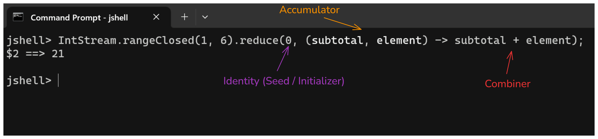

# Lecture 2 - Declarative Programming w Java Streams
- OOP is about how to model the problem.
- Declarative Programming is one of the ways to solve the problem itself.

Formulae for summation formula:
$$
    \sum_{x=1}^{n} x
$$
- need to do some kind of looping, with some form of accumulation and aggregator to sum the values

- Using *streams*: Writing things in a pipeline form: i.e. `x.y().z()...`


## Streams
- there are two types of streams - primitive and generic streams.
#### Pipeline
- comprises of
	1. data source to start the stream (i.e. `rangeClosed`, `iterate`, `generate`)
	2. intermediate operations (i.e. `limit`, `filter`, `map`) to perform specific operations on the elements of the stream.
	3. a terminal operation (i.e. `sum`, `reduce`, `forEach`) to specify tasks to perform on the stream's elements
      - cannot have two terminal operators (i.e. when needing to print and sum elements, write **two different streams**!)

#### Integer Streams
- forming a stream for the domain $D = [1, n] \implies$ using the `.rangeClosed()` function.
- forming a steam with the `range()` function: i.e. $D = [1, n) \implies$ using the `.range()` function 

```java
// initialization
IntStream.rangeClosed(1, 10);

// chaining higher-order lambda functions
IntStream.rangeClosed(1, 10).forEach(x -> System.out.println(x));
```
	
- using the `sum()` function
```java
jshell > IntStream.rangeClosed(1, 10).sum()
55
```

- chaining the pipeline:
```java
IntStream.rangeClosed(1, 10).
   forEach(x -> System.out.println("x^2 of " + x + " is " + x * x));
```

Note: `jshell` uses the REPL method to check executability of the program and execute it if possible.
- $\therefore$ cannot just press enter when you have subsequent methods to call on a new line for readability.

```java
jshell> IntStream.rangeClosed(1,10).
   ...> limit(7)
$5 ==> java.util.stream.SliceOps$2@3632be31

jshell> IntStream.rangeClosed(1,10).
   ...> limit(7).
   ...> sum()
$6 ==> 28
```

## Higher Order Functions
Types are usually inferred when writing lambdas

Examples:
1. `.forEach(<lambda>)` - iterate through all elements and perform some action on it
2. `.map(<lambda>)` - iterates through all elements and perform some action on it **AND** also return a stream
	1. input and output types need to be the same
3. `.filter()` - usually for a conditional, returns a boolean `True/False`
	1. returns a stream
4. `.reduce()` - does a reduction operation or cumulative aggregation.
	1. input (binary function) and output types has to be the same


```java
jshell> IntStream.iterate(1, x -> {System.out.println("Iter: " + x); return x + 1;}).
   ...> limit(5).
   ...> filter(x -> {System.out.println("Filter: " + x); return x % 2 == 0;}).
   ...> forEach(x -> System.out.println(x));
Filter: 1
Iter: 1
Filter: 2
2
Iter: 2
Filter: 3
Iter: 3
Filter: 4
4
Iter: 4
Filter: 5
```

#### Reduce
- format of reduce is as below.
