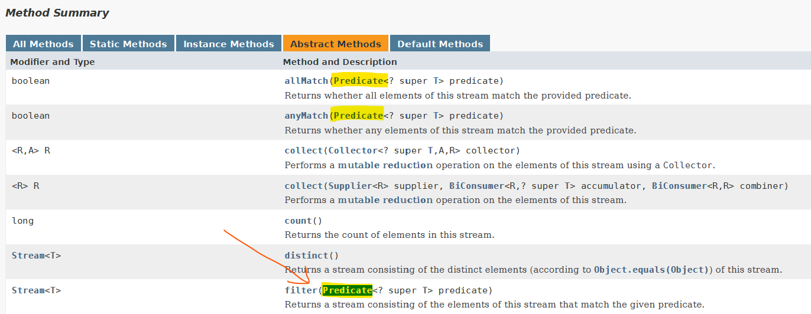

# Lecture 4 - Interfaces and Polymorphism
- interfaces are for constructing contracts (between **clients** and **implementers**)
    - interfaces enable the Polymorphic principle of classes
    - interfaces sit between the client and the implementer

- When talking about Circle and Point in our previous discussions:
	- **Point (Implementer)**
		- can actually change methods if it wants to that would potentially break the client (i.e. implementer can sabotage the client)
	- **Circle (Client $\implies$ needs point)**
		- has a point as its centre
		- will make use of services provide by the `Point` class


- "contracts" (or the `interface`) specifies 
	- which *methods* (services) that the implementer is **required to provide** to the client (for use)
	- client refers to the contract to find out the services that are available
	- one class can implement ***one or more interfaces*** (i.e. `Shape` and `Movable`)

Interfaces are somewhat similar to abstract class that they guarantee an implementation of some methods / API

### Notation (Relationships)
- solid lines for `has-a` relationships
	- "Circle has-a point" as its centre
- dotted line for softer dependency (`is-a` relationship)
	- "Circle is-a shape"

### Rules
1. interface specifies *what is can do*, but **not** define how to do something (up to the implementer)
	- there is no method body (don't need to pass in anything $\implies$ close it off with a semicolon)
2. all methods specified by the interface **must be `public`ly accessible**
	- the method is implicitly public (client needs to make use of public services)
	- methods specified in the interface **must be implemented by classes** that implement the particular interface

3. Specifying the interface for the class
```java
interface Shape{
	public double getArea();
}

class Circle implements Shape{
	...
	// has to define this (as "public" access)
	public double getArea(){
		// implementation
	}
	...
}
```

### Effects of Interfaces
- ability to use `Shape` interface to accept a `Circle` object (since Circle is-a shape).
- cannot do `new Shape()` $\implies$ does not have a constructor so cannot instantiate an object.
	- good because it must be a valid shape to be passed into methods like `findVolume`
```java
jshell> Shape s = new Circle(2.0)
s ==> Circle with radius: 2.0

// the original method (accepts circles only)
jshell> double findVolume(Circle c, double height){
   ...>     return c.getArea() * height;
   ...> }
|  modified method findVolume(Circle,double)


// modified to fit classes implementing shape
jshell> double findVolume(Shape s, double height){
   ...>     // guaranteed to have a getArea() method
   ...>     return s.getArea() * height;
   ...> }
|  created method findVolume(Shape,double)

jshell> findVolume(s, 1.0);
$11 ==> 12.566370614359172

```

```java
// creating a rectangle object
jshell> Rectangle rect = new Rectangle(15.0, 2.0);
rect ==> Rectangle of dimensions 15.0 by 2.0

jshell> rect.getArea()
$18 ==> 30.0

jshell> findVolume(rect, 10)
$19 ==> 300.0

```

```java
// creating a circle object and shape methods
jshell> Circle c = new Circle(2.14);
c ==> Circle with radius: 2.14

jshell> c.getArea();
$21 ==> 14.387237716379818

jshell> findVolume(c, 10)
$22 ==> 143.87237716379818
```

### Is-A Relationships & Polymorphism
something can **take many forms**
- it will **behave differently** when it takes the different forms (i.e. `getArea()` for Circle has its own implementation and likewise for `getArea()` of Rectangle or any classes extending the Shape interface)
	- $(\pi \cdot radius^2) \: versus \: (w \cdot h)$
- can create a list of different shapes
	- put in the specific implementations in the immutable list (i.e. using `List.of()`)
```java
jshell> List<Shape> sList = List.of(new Circle(2.5), new Rectangle(4, 5), new Circle(1.2))
sList ==> [Circle with radius: 2.5, Rectangle of dimensions ... , Circle with radius: 1.2]

jshell> sList.stream().map(shp -> findVolume(shp, 7.5)).toList()
$27 ==> [147.26215563702155, 150.0, 33.929200658769766]
```


### Multiple Interfaces
```java
jshell> Circle c = new Circle(10, new Point(4, 5))
c ==> Circle with radius: 10.0 and centre (4.0, 5.0)

jshell> c.moveBy(2, 5)
$8 ==> Circle with radius: 10.0 and centre (6.0, 10.0)

jshell> Movable moveX(Movable mov, double dx){
   ...>     return mov.moveBy(dx, 0);
   ...> }
|  created method moveX(Movable,double)

jshell> moveX(c, 2)
$10 ==> Circle with radius: 10.0 and centre (6.0, 5.0)
```

### Common Pitfalls
- the type of the object (and by extension the interface's "type") is important in determining which kind of methods that it can call
```java
jshell> Circle c1 = new Circle(1.5, new Point(3,2))
c1 ==> Circle with radius: 1.5 and centre (3.0, 2.0)

jshell> Shape s1 = c1
s1 ==> Circle with radius: 1.5 and centre (3.0, 2.0)

jshell> s1.getArea()
$13 ==> 7.0685834705770345

jshell> s1.moveBy(1,1) // errors out as s1 is-a Shape "type"
|  Error:
|  cannot find symbol
|    symbol:   method moveBy(int,int)
|  s1.moveBy(1,1)
|  ^-------^
```

- return values are **very important** when trying to do any form of method chaining (i.e. `c1.getArea(...).moveBy(...)`)

---
### The `List` interface
- cannot do `new List()`
- cannot add elements to `List.of()` $\implies$ immutable type

- don't allow mutable types like `ArrayList` due to side-effects (mutability)

- `List<E>` is a generic interface because of the angled brackets
	- can be an interface of anything

#### Super Interfaces
- one or more interfaces that an interface abides by

---
### Functional Interfaces
- are interfaces with a **single abstract method**
- implementations of a functional interfaces can be a Concrete Class, an Anonymous Class or a Lambda Expression
	- for lambda operations like `filter()` and `allMatch()`, we specify the implementation of the Predicate interface
		- `interface Predicate<T>` is a functional interface with only *one method*

	