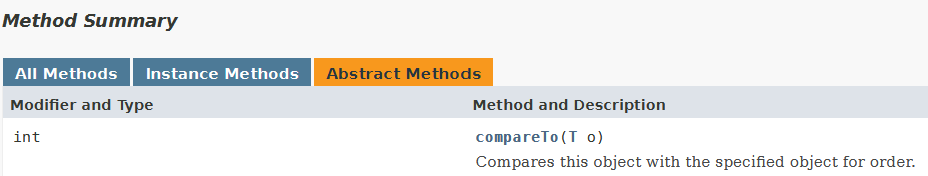
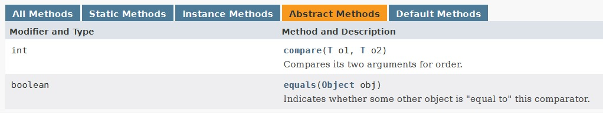

# Lecture 4 - Interfaces and Polymorphism

### Interfaces
- interfaces are for constructing contracts (between **clients** and **implementers**)
    - interfaces enable the Polymorphic principle of methods
    - interfaces sit between the client and the implementer

- When talking about Circle and Point in our previous discussions:
	- **Point (Implementer)**
		- can actually change methods if it wants to that would potentially break the client (i.e. implementer can sabotage the client) 
			- $\implies$ should have a **contract of services** that both parties (client and implementer obey), which is called **programming to the interface, not the implementer**
	- **Circle (Client $\implies$ needs point)**
		- has a point as its centre
		- will make use of services provide by the `Point` class


- "contracts" (or the `interface`) specifies 
	- which *methods* (services) that the implementer is **required to provide** to the client (for use)
		- specify method declarations
	- client refers to the contract to find out the services that are available
	- one class can implement ***one or more interfaces*** (i.e. `Shape` and `Movable`)

Interfaces are somewhat similar to abstract class that they guarantee an implementation of some methods / API

### Notation (Relationships)
- *solid lines* for `has-a` relationships
	- "Circle has-a point" as its centre
- *dotted line* for softer dependency (`is-a` relationship)
	- "Circle is-a shape"

### Rules
1. interface specifies *what is can do*, but **not** define how to do something (up to the implementer)
	- there is no method body (don't need to pass in anything $\implies$ close it off with a semicolon)
2. all methods specified by the interface **must be `public`ly accessible**
	- the method is implicitly public (client needs to make use of public services)
	- methods specified in the interface **must be implemented by classes** that implement the particular interface

3. Specifying the interface for the class
```java
interface Shape{
	public double getArea();
}

class Circle implements Shape{
	...
	// has to define this (as "public" access)
	public double getArea(){
		// implementation
	}
	...
}
```

### Effects of Interfaces
- ability to use `Shape` interface to accept a `Circle` object (since Circle is-a shape).
- cannot do `new Shape()` $\implies$ does not have a constructor so cannot instantiate an object.
	- good because it must be a valid shape to be passed into methods like `findVolume`
```java
jshell> Shape s = new Circle(2.0)
s ==> Circle with radius: 2.0

// the original method (accepts circles only)
jshell> double findVolume(Circle c, double height){
   ...>     return c.getArea() * height;
   ...> }
|  modified method findVolume(Circle,double)


// modified to fit classes implementing shape
jshell> double findVolume(Shape s, double height){
   ...>     // guaranteed to have a getArea() method
   ...>     return s.getArea() * height;
   ...> }
|  created method findVolume(Shape,double)

jshell> findVolume(s, 1.0);
$11 ==> 12.566370614359172

```

Note: the `findVolume()` method takes in something of "interface type" `Shape`, but **not a Shape object** $\implies$ since Shape cannot be instantiated (it is an interface)

```java
// creating a rectangle object
jshell> Rectangle rect = new Rectangle(15.0, 2.0);
rect ==> Rectangle of dimensions 15.0 by 2.0

jshell> rect.getArea()
$18 ==> 30.0

jshell> findVolume(rect, 10)
$19 ==> 300.0

```

```java
// creating a circle object and shape methods
jshell> Circle c = new Circle(2.14);
c ==> Circle with radius: 2.14

jshell> c.getArea();
$21 ==> 14.387237716379818

jshell> findVolume(c, 10)
$22 ==> 143.87237716379818
```

### Is-A Relationships & Polymorphism
something can **take many forms** (i.e. Shape can be a rectangle or a circle, or another other shape that *implements it*)
- it will **behave differently** when it takes the different forms (i.e. `getArea()` for Circle has its own implementation and likewise for `getArea()` of Rectangle or any classes extending the Shape interface)
	- $(\pi \cdot radius^2) \: versus \: (w \cdot h)$
- can create a list of different shapes and run `findVolume()` on all of them at one go
	- put in the specific implementations in the immutable list (i.e. using `List.of()`)
```java
jshell> List<Shape> sList = List.of(new Circle(2.5), new Rectangle(4, 5), new Circle(1.2))
sList ==> [Circle with radius: 2.5, Rectangle of dimensions ... , Circle with radius: 1.2]

jshell> sList.stream().map(shp -> findVolume(shp, 7.5)).toList()
$27 ==> [147.26215563702155, 150.0, 33.929200658769766]
```

### Multiple Interfaces
- individual interfaces should specify what classes that implement them do (Interface Segregation Principle - a.k.a. don't force code to depend on methods that it *does not utilize*)

	

```java
jshell> Circle c = new Circle(10, new Point(4, 5))
c ==> Circle with radius: 10.0 and centre (4.0, 5.0)

jshell> c.moveBy(2, 5)
$8 ==> Circle with radius: 10.0 and centre (6.0, 10.0)

jshell> Movable moveX(Movable mov, double dx){
   ...>     return mov.moveBy(dx, 0);
   ...> }
|  created method moveX(Movable,double)

jshell> moveX(c, 2)
$10 ==> Circle with radius: 10.0 and centre (6.0, 5.0)
```

### Common Pitfalls
- the type of the object (and by extension the interface's "type") is important in determining which kind of methods that it can call
```java
jshell> Circle c1 = new Circle(1.5, new Point(3,2))
c1 ==> Circle with radius: 1.5 and centre (3.0, 2.0)

jshell> Shape s1 = c1
s1 ==> Circle with radius: 1.5 and centre (3.0, 2.0)

jshell> s1.getArea()
$13 ==> 7.0685834705770345

jshell> s1.moveBy(1,1) // errors out as s1 is-a Shape "type"
|  Error:
|  cannot find symbol
|    symbol:   method moveBy(int,int)
|  s1.moveBy(1,1)
|  ^-------^
```

- return values are **very important** when trying to do any form of method chaining (i.e. `c1.getArea(...).moveBy(...)`)

- ❌ use of `default` methods (**impure** interface) $\implies$ child class can't decide which one to use

---
### The `List` interface
- cannot do `new List()` since it is an interface (can't instantiate objects from interfaces)
- cannot add elements / perform modifications using `List.of()` creation syntax $\implies$ immutable `AbstractImmutableList` type 
	- `of()` is the "factory method" of the interface `AbstractImmutableList`

- don't allow mutable types like `ArrayList` due to side-effects (mutability)

- `List<E>` is a generic interface because of the angled brackets
	- can be an interface of anything

#### Super Interfaces
- one or more interfaces that an interface abides by
	- i.e. `List` abides by `add()` and `sizeof()` methods specified by `Collection` interface and other from `Sequence` etc.

---
### Functional Interfaces
- are interfaces with a **single abstract method**
	- so that there is no ambiguity to the method that the implementer is implementing (i.e. `Circle` is guaranteed to only implement `moveBy(x,y)` which takes in two `double`s)

- each *lambda expression* is an implementation of *some functional interface* in the Java API
	- i.e. we pass `new Circle(...)` into `shapeList.stream().filter()`
	- there is no indication that we are writing a predicate or whatever input type for the abstract method of the functional interface (i.e. don't need to specify it is for `public boolean test()`)

- implementations of a functional interfaces can be a *Concrete Class, an Anonymous Class or a Lambda Expression* (lambda is preferred)
	- for lambda operations like `filter()` and `allMatch()`, we specify the implementation of the Predicate interface
		- i.e. `interface Predicate<T>` is a functional interface with only *one method*

	

#### Types of Functional Interfaces
1. **Primitive Functional Interfaces**
	1. interfaces whose type is fixed (i.e. `IntPredicate`)
	2. refer to documentation for single abstract methods that need to be implemented
		1. i.e. `test(int x)` for `IntPredicate`
		2. i.e. `applyAsInt(int x)` for `IntUnaryOperator`

2. **Generic Functional Interfaces**
	1. Similar to primitive one, but the type is general and not fixed (i.e. the corresponding generic functional interface for the primitive interface `IntPredicate` can be `Predicate<T>`, where `<T>` can be `String` or `Integer` etc.)
	2. Case Study example 1: [`Comparable<T>`](https://docs.oracle.com/javase/8/docs/api/java/lang/Comparable.html)
		1. `Comparable` is implemented to provide natural ordering amongst object of a particular class
		2. has an *abstract method `compareTo()`* $\implies$ compares itself against another string, lexicographically

		


	3. Case Study example 2: [`Comparator<T>`](https://docs.oracle.com/javase/8/docs/api/java/util/Comparator.html) $\implies$ ignore the `equals(Object obj)` method inherited from `java.lang.Object`.
		1. used for comparing the lengths between `String`s or other generic types(?)
		2. takes in two arguments (unlike the one for `Comparable<T>`)

		
		3. Lambda expression as a `Comparator`
		```java
		Comparator<String> cmpLen = (x, y) -> x.length() - y.length();
		cmpLen("xyz", "abc"); // returns 0

		List.of("abc", "xyz").sort(cmpLen) // cannot sort the list -> immutable
		
		// get a new list that is sorted
		List.of("abc", "xyz").stream().sorted(cmpLen).toList() 
		```

	4. Additional example: `UnaryOperator<T>`
		1. inherits abstract method `apply(T t)` from `Function<T, R>`

#### Finding functional interfaces
- under the method documentation in Java docs, find "Specified by", which implies that the method follows some contract (i.e. there is some interface for it)
	- i.e. `String` implements `Comparable<T>`