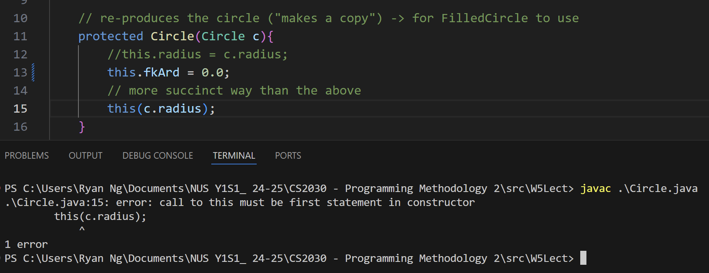
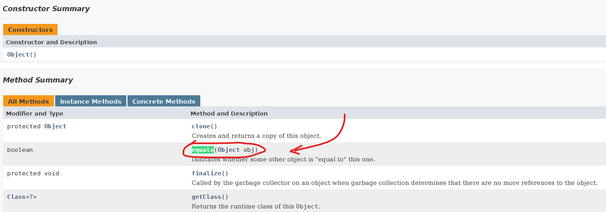

# Lecture 5 - Inheritance and Substitutability
- inheritance supports the `is-a` relationship (implementing interfaces)
- is about classes now
### Principles to follow
1. *Don't Repeat Yourself*
	- if we need to have duplicated quote, it should just reside in one location/place (i.e. one file only)

2. *Abstraction Principle*
	- each significant piece of functionality should be implemented in **one place** in the source code
	- combine codes with similar functionalities by **abstracting out the varying parts**
	- example: using `map()` in Streams
		- go through every element and do something (perform a mapping)
		- varying parts refers to the Predicate or function that is passed into the `map()` function

### Defining Sub-classes
- sub-classes are very similar to their parent classes in terms of implementations (have similar properties)
- aim is to create sub-classes that don't repeat what is already defined in the super class/parent
	- make use of the **parent's constructor for certain properties** that are inherited
	- also inherit some of the methods that have already been defined in the parent class

- If `Circle` is a super class of `FilledCircle` and `Circle` implements the `getArea()` method as specified by the interface `Shape` that it implements, then `FilledCircle` need not re-define a `getArea()` method (unless there is a need to do so).

- a class **can** *implement multiple interfaces*, but a **child class CANNOT extend** from *multiple parents*
	- `class A extends B, C {...}` ❌
	- *cannot extend from multiple parents* especially when their methods / method signatures are the **same** (cannot disambiguate which to use)
	- a class can implement multiple interfaces because the class itself implements method(s) of each of the interfaces

#### The `super` keyword
- is **not a reference**, unlike `this` (cannot be returned)
	- `FilledCircle fc = this; // perfectly valid`
- can only to `super.<smthg>`

### `protected` access modifier
- provides access to properties / methods to **all other classes within the same package** (not only for the child classes' access itself) $\implies$ even though main purpose is for the child to use the parent's properties.

```java
class Circle implements Shape {
	// change to protected to let children access prop in constructor
	protected final double radius; 

    Circle(double radius){
        this.radius = radius;
    }
 ...
 }
```

```java
jshell> FilledCircle new1 = new FilledCircle(1.0, Color.BLUE).fillColor(Color.RED)
new1 ==> Filled Circle with radius: 1.0 and color java.awt.Color[r=255,g=0,b=0]
```
- don't use the variable in the client (only in children)

### Workaround for `protected`
- if we have to use `private final` for the super classes' property that the child class accesses
	- idea: let the parent class take charge of  constructing the `radius` (`FilledCircle` makes use of `Circle` to construct the "inside")

```java
// the parent class
class Circle {
    private final double radius;
    // private final double diameter;

    Circle(double radius //diameter) {
        this.radius = radius;
	    // this.diameter = diameter;
    }

    protected Circle(Circle circle) {
        this.radius = circle.radius; // or this(circle.radius);

		// uncomment below to change property/attribute to diameter instead
		// this.diameter = circle.diameter
    }
    ...

	// good practice not to have a public radius-getter method
}
```

```java
// the child class
class FilledCircle {
    private final Color color;

    private FilledCircle(Circle circle, Color color) {
        super(circle);
        this.color = color;
    }

    FilledCircle fillColor(Color color) {
        return new FilledCircle(this, color);
    }
    ...
}
```

*side note:* If we change the property of `radius` to` diameter` in this case, then we only expect that we are required to **change the `Circle` class**, while `FilledCircle` (i.e. the "client" of `Circle`) does not need to have any changes on our end (since `FilledCircle` is a client).
### Method Overloading
- methods of the same name, but using different argument lists.
- **number, type and order of args matter!** $\implies$ focus on what is ***inside the brackets***.
	- not the return type or accessibility
	-  i.e. `toString()` versus `toString(String prompt)`
#### Constructor Overloading
- constructor is just a special variant of method to instantiate object
- ensure that there are clear differences in method signature (***number of args, input type, order of arguments*** etc.) to ensure that there is no ambiguity btwn constructors so that code can compile alright.

#### Constructor Chaining
- can have one constructor ***make use of another*** overloaded one by using `this()` constructor method $\implies$ using `this(circle.radius)` invokes the constructor `Circle(double radius)`.
	- `this(...)` looks for another constructor with a matching (constructor) signature
	- can only call one constructor within another and it should be at the top line!
	
### Method Overriding
- only for inheritance relationships, not for interfaces
- done by default when we specify a "custom" method with the same signature in the child/sub-class (as the super class).
- by default the child calls **the parent's `toString()` method** if it is not implemented for the child class, same thing for `getArea()` in `FilledCircle`.
	- **not the case for interfaces** where there **IS A NEED to IMPLEMENT** the specifications (i.e. methods that are guaranteed)

- should only be for inheritance (to child and parent classes)
	- use the `@Override` tag to make sure we are overriding

---
### Substitutability
> Notation: $S \implies subclass, \: T \implies super class$ 

- using assignment operators to assign superclass to subclass

```
var_T = expression_S
```

- statement above is only valid is **S is-a T** (can substitute S for T) $\implies$ `Circle` is substitutable for Shape, `FilledCircle` is substitutable for `Circle`
	- can assign `Circle` as a `Shape` (since it implements shape) $\to$ a class that implements an interface is substitutable for that interface
	- can assign `FilledCircle` as a `Circle` (since it is a child of the Circle class) $\to$ a child class is substitutable for its parent
```java
Shape s = new Circle(10);
Circle fc = new FilledCircle(10, Color.BLUE);
```


```java
new Circle(1.0).getArea() // valid
new FilledCircle(1.0, Color.GREEN).getArea() // perfectly valid as well
```
 - $\therefore$ methods of `S` can be invoked by `T`  as well (i.e. `FilledCircle` can call the `getArea()` method as defined by `Circle`, which is the parent of `FilledCircle`)

Substitutability is also present in method calling / definitions.
```java
public foo(variable_t){
	// do something
}

jshell> foo(expression_s); // expression_s is the parameter passed into method foo.

// calling a method with an expression is an assignment from the parameter s to the variable t
```

`circle.fillColor(Color.GREEN)` ❌ (recall that `fillColor(Color clr)` is only implemented by `FilledCircle`)
#### Liskov Substitution Principle
- an object such as a class can replace by a sub-object (i.e. sub-class that *extends* that first class), without breaking the program.
	- used when developers use *inheritance* concepts

---
### Compile-Time vs Run-Time type
- have to compile Java programs before running them (think about the various stages carefully!)
#### Compilation Time/Stage
can the program compile? $\to$ important to check even before running it
- check the types of the variables declared $\implies$ it is all about substitutability
- restricts the method that the program can call during compilation based on the type.

- during compilation, we **DO NOT YET KNOW** what is the *actual object being passed* in as an argument to a method

*consider this example:*
```java
Circle circ = new FilledCircle(1.0, Color.BLUE)
```
1. the compile-time type of the variable `circ` is `Circle` $\implies$ checks if the assignment is possible, but the compiler is **not doing the assignment** at this stage.
	1. don't even look at what is being assigned!
	2. just check `Circle circ = ` ✅ , $\therefore$ can compile
2. ⚠️ `circ` at this stage can call `getArea()` and `toString`, but **NOT** `fillColor()`!

#### Run-Time Stage
- the assignment actually takes effect
- run-time type is useful when we having overriding methods (i.e. `toString()`, `getArea()`)

*consider this example again:*
```java
Circle circ = new FilledCircle(1.0, Color.BLUE)
```
1. The actual type of the object is assigned (i.e. run-time type of `circ` is now `FilledCircle`)
2. Method to call is `toString()` *of the `FilledCircle` class* since the constructor is invoked $\implies$ this is the stage where it is decided whether Circle's `toString()` or FilledCircle's `toString()` should be ran
	1. remember from Compile-Time, `fillColor()` is no longer valid!
	2. Polymorphism occurs at this stage

#### Static & Dynamic Binding
- during compilation, static binging helps to do the solution of methods to call (including overloaded methods)

- only during runtime, dynamic binding resolves the actual method to be called among all overriding methods
	- get to the actual object type itself to run the `getArea()` method (Circle, Square, Rectangle?)

---
### Object equality
- using the `==` comparison operator
	- two uniquely constructed objects are not equal

```java
jshell> new Circle(2.0) == new Circle(2.0)
$3 ==> false
```


- when designing a class, it makes sense (following intuition) to create/redefine object equality
	- using the `equals()` method from somewhere, since it still runs and is not defined in the `Circle` class? $\implies$ *Object class*
```java
jshell> new Circle(2.0).equals(new Circle(2.0))
$4 ==> true
```



#### Overloaded Object Equality Implementation(???) 🤔
Inside `Circle.java`:
```java
// overloaded equals
boolean equals(Circle c){
	return this.radius == c.radius;
}
```

```java
jshell> new Circle(2.0).equals(new Circle(2.0))
$5 ==> true

jshell> new Circle(2.0).equals(new Circle("abc"))
|  Error:
|  no suitable constructor found for Circle(java.lang.String)
|      constructor Circle.Circle(double) is not applicable
|        (argument mismatch; java.lang.String cannot be converted to double)
|      constructor Circle.Circle(Circle) is not applicable
|        (argument mismatch; java.lang.String cannot be converted to Circle)
|  new Circle(2.0).equals(new Circle("abc"))
|                         ^---------------^

jshell> new Circle(2.0).equals("abc")
$6 ==> false
```
but...
```java
jshell> Shape s = new Circle(1.0)
s ==> Circle with radius: 1.0

jshell> s.equals(new Circle(1.0))
$14 ==> false  // why? -> taking the Object class' equals() method which compares objects
```

#### Object Equality using Overriding ✅
- better implementation
```java
@Override
public boolean equals(Object obj){
	// trivial check -> for the same object
	if (obj == this){
		return true;
	}

	// type check
	if (obj instanceof Circle circle){
		return this.radius == circle.radius;
	}
	return false;
}
```

- using `instanceof` allows one to check if the argument is of the same time before we do something
	- should restrict yourself to using "`instanceof A`" only within class `A` itself.

### Abstract classes
- are a "template"


**Abstract Classes** have the following:
- properties
- usually have $\gt 1$ abstract method (to be implemented by their children)
	- they don't contain a method body/implementation details
- other methods (i.e. `toString()`)

*Important Pointers*
- Abstract classes can't be instantiated
- Abstract classes can't be marked as final too (required to have a child class to implement methods)
- use the `abstract` keyword to define abstract methods which have no method body
	- *not necessary / not a must* that an abstract class is required to have an abstract method

- subclass of the abstract class **must implement all abstract methods** where specified $\implies$ to ensure compile time safety

- when we know the methods, but we may not know how they are implemented

*Samples:*
```java
import java.awt.Color;

abstract class FilledShape{
	private final Color color;
	
	FilledShape(Color color){
		this.color = color;
	}
	
	public abstract double getArea();
	
	Color getColor(){
		return this.color;
	}
	
	@Override
	public String toString(){
		return "Filled Shape with " + this.color;
	}
}
```


```java
abstract class Driver {
    private final String lPlate;
    private final int wtTime;

    Driver(String lPlate, int wtTime) {
        this.lPlate = lPlate;
        this.wtTime = wtTime;
    }

    abstract public double calcFare(Request rq);

    @Override
    public String toString() {
        return this.lPlate + " (" + this.wtTime + " mins away)";
    }
}
```