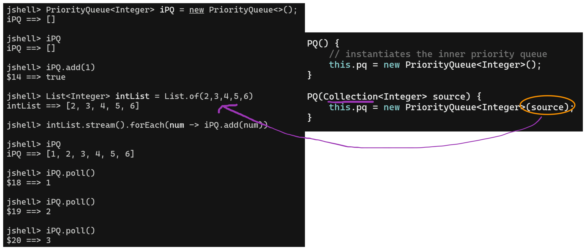
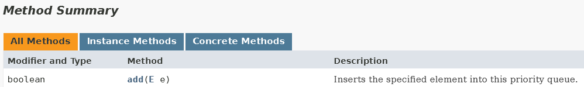

# Lecture 6 - Java Generics

## Motivation
- reasons of having generics: 
	- to enable polymorphism
	- to develop a **structure** that can be used for different types (almost the same, apart from the element type `<E>` being different)

- have are the constructs in the `PQ` class in lab03?
- in its simplest form, it is invariant -> can only have `PQ<Shape>` accept `Collection<Shape>`

## Case Study: PQ vs Java's PQ
Why we use our own Priority Queue, instead of the one provided out of the box?
- Java's implementation of `PriorityQueue<E>` is **mutable** (we don't use mutable stuff in this class) $\implies$ has the side effect / changes even when no assignment is done.

- when using `PriorityQueue<?> pq.poll()` method, it returns the first element of the natural order of strings (*lexicographical order*)
  
- allows for code specialization where a new class definition is generated and compiled for every class

### Java's Mutable `PriorityQueue<E>`
- is a mutating structure
- can be used to store many different Reference Types (sorta like a "list" but with another data structure)

```java
jshell> PriorityQueue<String> strPQ = new PriorityQueue<>();
strPQ ==> []

jshell> strPQ.add("one")
$3 ==> true

jshell> strPQ.add(1)
|  Error:
|  incompatible types: int cannot be converted to java.lang.String
|  strPQ.add(1)
|            ^

jshell> strPQ.add("two")
$4 ==> true

jshell> strPQ.poll()
$5 ==> "one"

jshell> strPQ // is modified
strPQ ==> [two]

jshell> strPQ.poll()
$7 ==> "two"

jshell> strPQ.poll()
$8 ==> null
```

### Creating our own PQueue
- hidden from the client is actually Java's implementation of the mutable Priority Queue
	- doing this for quick prototyping (something that works with nice design)
	- not doing it from scratch

- can dedicate the PQueue class for the `Integer` class type  $\implies$ copy pasting code for other data types like PQueue for `String` or `Double` class types?

```java
import java.util.Collection;
import java.util.PriorityQueue;

class PQ {
    private final PriorityQueue<Integer> pq;

    PQ() {
        // instantiates the inner priority queue
        this.pq = new PriorityQueue<Integer>();
    }

	// another way of instantiating
    PQ(Collection<Integer> source) {
        this.pq = new PriorityQueue<Integer>(source);
    }

    boolean isEmpty() {
        return this.pq.isEmpty();
    }

    int size() {
        return this.pq.size();
    }

    @Override
    public String toString() {
        return this.pq.toString();
    }
}
```

In this case, we use an immutable delegation pattern (i.e. make an immutable PQ off the original mutable PQ provided by Java)
- "tell someone else to do something" $\implies$ using `this.pq`

**Overloaded constructor**
- use of no params or `Collection<E> source`


#### Leveraging Delegation for Functionality
writing our own `add()` and `poll()` methods require us to make a copy and thereafter call the internal pq's respective method to perform the operation.
- `PQ<E> copy = new PQ<E>(this.pq);`
##### `add()`
- original `PQ.add()` $\to$ add the thing inside and return `true`, details are abstracted
- our implementation $\to$ create a copy, modify the copy and then return the copy (of the original)
```java
PQ add(Integer ele){
	// need to create a copy before mutating 
	// or changing the pq data struct
	PQ copy = new PQ(this.pq);

	// access the internal data struct and use method
	copy.pq.add(ele);
	
	return copy;
}
```

- allows for pipelining, which `PriorityQueue<E>` does not provide $\implies$ `add()` returns a `boolean` value
	- **mutable** data structures **don't allow** pipelining and $\therefore$ the need to implement our own immutable versions.
	

##### `poll()`
- new `PQ` returns modified PQ and first int
- using the new PQ allows one to have pipelining
```java
Pair poll() {
	PQ copy = new PQ(this.pq);
	Integer ele = copy.pq.poll();

	// give back the first element and the updated copy of PQ
	return new Pair(ele, copy);
}
```

```java
jshell> new PQ().add(1).add(2).poll().u().poll().u().poll()
$12 ==> Pair[t=null, u=[]]
```
As per above, still need not take care or the `null` appearing.

```java
Pair<Optional<E>, GPQ<E>> poll() {
	GPQ<E> copy = new GPQ<E>(this.pq);

	// try not to use Optional.of() if value can be null
	Optional<E> ele = Optional.ofNullable(copy.pq.poll());

	// give back the first element and the updated copy of PQ
	return new Pair<Optional<E>, GPQ<E>>(ele, copy);
}
```
To handle that after declaring the generic types, we can make the pair (first element return an `Optional<E>`, since this can indicate an absence of a value in place of `null`).

---
## Using generics
Allows the PQ class to take in different class type.
- not good to have implementations of `PQ<Integer>` and `PQ<String>` etc. in separate files $\implies$ violates Don't Repeat Yourself!

Generics allow us to input *parameterized types*, have `PQ<Integer>`, `PQ<String>`, `PQ<Shape>`, `PQ<Circle>` etc. into a single "instance"

> *def*: Generic type declaration is when we do `PQ<E>` or `LinkedList<E>` in a class etc.

### Conventions
Using a single capital letter to denote
1. `E` - element
2. `V` - values
3. `R` - return type
4. `T` or `U` - general types

-  the type declaration is scoped within the method
	- we can use `PQ<E>` or `PQ<T>` to parameterize the type for our PQ data structure

### PQ Empty and Nullable
- original PQ method returns null if empty
- Optionals are introduced to catch the cases where `null` is returned (see the above note)
- Note that `Optional.of()` cannot catch null values $\implies$ returns null pointer exception
	- instead **we use `Optional.ofNullable()`** $\implies$ returns `Optional.empty()` for null values returned by the internal PQ's `poll()` method, the value being polled otherwise.

---
## Bounded Type Parameters
### Polymorphism using type `E`
- We usually accept the generic type `<E>` by default, but the `PriorityQueue` should have **some form of natural ordering** (values must be comparable with each other, i.e. implement `Comparable<E>` interface)
	- an exception is thrown by our `PQ` if we pass in something with no natural ordering

```java
// should not allow this kind of behaviour
jshell> class A{}
|  created class A

jshell> new GPQ<A>()
$8 ==> []

jshell> new GPQ<A>().add(new A()) // throws exception as not comparable type
|  Exception java.lang.ClassCastException: class REPL.$JShell$17$A cannot be cast to class java.lang.Comparable (REPL.$JShell$17$A is in unnamed module of loader jdk.jshell.execution.DefaultLoaderDelegate$RemoteClassLoader @5a61f5df; java.lang.Comparable is in module java.base of loader 'bootstrap')
```

- used  **when `<E>` is too loose**  $\implies$ need to specify that it is bounded to `Comparable` types only
	- achieved using `PQ<E extends Comparable<E>>` *(subtype of comparable interface)* to restrict the "types" accepted
	- gives a compilation error (code is wrong in the first place $\implies$ should not run!)

```java
jshell> /open GPQ.java

jshell> new GPQ<A>().add(new A())
|  Error:
|  type argument A is not within bounds of type-variable E
|  new GPQ<A>().add(new A())
|          ^
```

### Changing what PQ returns first
- what if we want PQ to return the larger value first before the smaller one?
	- need the PQ to take in an external comparison via the `Comparator` $\implies$ add another constructor
	
```java
GPQ() {
	// instantiates the inner priority queue
	this.pq = new PriorityQueue<E>();
}

GPQ(Collection<E> source) {
	this.pq = new PriorityQueue<E>(source);
}

GPQ(Comparator<E> cmp){
	// delegation
	this.pq = new PriorityQueue<E>(cmp);
}

GPQ(Collection<E> source, Comparator<E> cmp) {
	this.pq = new PriorityQueue<E>(cmp);
	this.pq.addAll(source);
}
```

A comparator is an implementation of a functional interface, with the abstract method `compare(T o1, T o2)`

```java
jshell> new GPQ<String>().add("abc").add("aaaa").poll()
$10 ==> Pair[t=Optional[aaaa], u=[abc]]

jshell> new GPQ<String>((x, y) -> x.length() - y.length()).add("abc").add("aaaa").poll()
$11 ==> Pair[t=Optional[abc], u=[aaaa]]
```

This manipulates the PQ to return the string with the **shorter length first** (overriding lexicographical order).

### Making Shapes Comparable -- Generics & Substitutability
Circle does not implement `Comparable<Circle>` but it implements `Comparable<Shape>`

We want to make Shape comparable by its Area. What is going to be the `compareTo()` method?
```java
// i.e. in Circle
...
int compareTo(Circle othr){
	return this.getArea() versus other.getArea()
}
...
```

```java
// compareTo() for area is  within the Shape abstract class -> Shape can't be an interface

// getArea() methods are implemented by Shape's children
abstract class Shape implements Comparable<Shape> {
    public abstract double getArea();

    public int compareTo(Shape other) {
        return (int) Math.signum(this.getArea() - other.getArea());
    }
}
```

- ⚠️ Java Generics in its **simplest form is invariant** $\implies$ `PQ<Shape>` can only take in `List<Shape>` or `Set<Shape>` etc. but **NOT** `List<Circle>` or `List<Rectangle>` etc.
	- have to use bounded wildcards
#### Upper bounded Wildcard
*Problem:* If we use generic data types, i.e. `List<Circle> cir = List.of(new Circle(...), ...)` or `PQ<Circle> = new PQ<>().add(new Circle(...)).add(new Rectangle(...))` or a collection of Shape sub-objects is not allowed
- Enables the **PQ Generic class** to take in *anything below the Shape interface* (the class itself and its sub/child classes).
    - use `<? extends E>`, read as "any extends E"

```java
GPQ(Collection<? extends E> source) {
	this.pq = new PriorityQueue<E>(source);
}
```
- allows `PQ<Shape>` to accept both `List.of(Circle)` and `List.of(Rectangle)`

`List<? extends Number> numList` $\implies$ can accept Double, Integer and Number types
#### Lower bounded Wildcard
*Problem:* `Circle` doesn't extend `Comparable<Circle>` i.e. does not have a parent that has `Comparable<Circle>`, so using `new PQ<Circle>(List.of(...))` **does not work**!
- Circle only implements `Comparable<Shape>` $\implies$ lower-bounded wildcard allows `new PQ<Circle>(...)` and `new PQ<Shape>(...)` to work

- enables `new PQ<Circle>(List.of(<circles>))` to be admissible
    ```E extends Comparable<? super E>``` , read as "any super E"

```java
class GPQ<E extends Comparable<? super E>>{
...
GPQ(Comparator<? super E> cmp) {
	// delegation
	this.pq = new PriorityQueue<E>(cmp);
}

GPQ(Collection<? extends E> source, Comparator<? super E> cmp) {
	this.pq = new PriorityQueue<E>(cmp);
	this.pq.addAll(source);
}
```

running with `jshell`
```java
jshell> List<Shape> slist = List.of(new Circle(2), new Rectangle(3,4), new Circle(6))
slist ==> [Circle with radius 2.0, Rectangle 3.0 by 4.0, Circle with radius 6.0]

jshell> List<Circle> clist = List.of(new Circle(1), new Circle(.5))
clist ==> [Circle with radius 1.0, Circle with radius 0.5]

jshell> new GPQ<Shape>(slist)
$18 ==> [Rectangle 3.0 by 4.0, Circle with radius 2.0, Circle with radius 6.0]

jshell> new GPQ<Shape>(clist)
$19 ==> [Circle with radius 0.5, Circle with radius 1.0]

jshell> new GPQ<Circle>(clist)
$20 ==> [Circle with radius 0.5, Circle with radius 1.0]
```
- need to also make `Comparator<? super E>`, or else `Comparator<Shape>` will not be accepted for something `PQ<Circle>`

```java
jshell> Stream.iterate(new GPQ<Shape>(slist),
   ...> pq -> !pq.isEmpty(),
   ...> pq -> pq.poll().u()).
   ...> forEach(pq -> pq.poll().t().
   ...> ifPresent(x -> System.out.println(x)))
Rectangle 3.0 by 4.0        // 12.0
Circle with radius 2.0      // 12.566
Circle with radius 6.0      // 113.09
```

### Producer and Consumer
Look at the `.map()` method of the stream class
- takes in a function with type T and produces a return type R, which may vary from type T

- **PECS**
	- Function consumes T (hence super)
	- Function produces something (hence extends)

- Comparator/Comparable consumes
- Collection produces

```java
// source produces elements to store in the PQ
GPQ(Collection<? extends E> source) {
	this.pq = new PriorityQueue<E>(source);
}

// cmp reads in elements and does some computation to determine order
GPQ(Comparator<? super E> cmp) {
	// delegation
	this.pq = new PriorityQueue<E>(cmp);
}
```

In `Function<T, R>` the input type T is treated as the consumer, hence `? super T` and the output type is treated as a producer `? extends T`.

In the 
### Generic methods
- `List.of()` or `PQ.of()` is called from the class $\implies$ does not know what is E that is declared (use the `static` keyword)
	- allows the constructor to have `private` access modifier

### Type witnessing
- explicitly states the type to input (don't leave it to type inference)
    - `PQ.<String>of().add("1")`
    - `PQ.<Integer>of().add(2)`


---
## PA Supplementary Notes
**Commonly Used Imports**
```java
// data structures
import java.util.Optional;
import java.util.List;
import java.util.Scanner;

// streams
import java.util.stream.IntStream;
import java.util.stream.Stream;
import java.util.stream.Collectors; // technically might be banned

// interfaces
import java.util.Comparator;
import java.util.Comparable;

// coloured shape
import java.awt.Color;
```

**Pair**
```java
record Pair<T, U>(T t, U u){}
```

Use only `private final` as `protected` attributes are not allowed unless stated

**Constants**
- declare as `private static final <type> CONSTANT =  ......`

Rule of Thumb: If you are **storing attributes** (i.e. Driver class has `licensePlate` and `waitingTime`) or there is a requirement for `toString()`, then use an abstract class.

