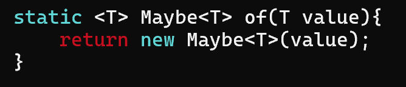
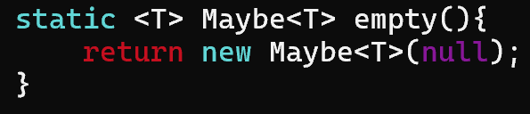

# Lecture 7 - Contexts
## What is a Computational Context
- for every context, the pattern or **thought process** in creating it is the **same**.
### Motivation
- Contexts provides a **service** to the client
	- wraps around some value and **abstracts away computations** associated with the particular context
	- sandbox that allows functions to be safely executed

### Examples: 
- `Optional` $\implies$ context that handles invalid or missing values
- `Stream` $\implies$ handles "looping" for the client

- only wraps around **one** value

- need to test every branch in the methods of contexts

### Components of a Context
- a **way** to *wrap the value* within the box (i.e. using the *factory methods*, i.e. `of` and `empty` methods)
```java
jshell> Optional<Integer> optInt = Optional.<Integer>of(1);
optInt ==> Optional[1]

jshell> Optional<Integer> optInt = Optional.<Integer>empty();
optInt ==> Optional.empty
```

- a way to pass behaviour into the box with a **higher order functions** (method that take in other methods)
	- have the client pass in what they wish to do (i.e. `map()`, `filter()`, `reduce()`).

- How does the client interact with the context $\implies$ using cross-barrier manipulation
	- clients should be able to tell the functionality that they require

### Cross-barrier Manipulation
Describes how a client would interact with a context
- client passes the value to context and context manipulate on the client's behalf (doing it through the `filter()` method).

## The `Maybe` Context
- enables one to handle `null` or the absence of values
- mimics Java's optional, which is a computational context $\implies$ meant to do something for the user
	- implements all the methods that an optional may have

```java
// type declaration
class Maybe<T>{

}
```

**Maybe** is a class that takes in values of any type, or a **generic type** (i.e. `Maybe<T>`, so it can take in `String`, `Double`, `Integer` etc.) 
- instantiating maybe $\implies$ don't mention the name itself? (i.e. ❌ `new Maybe<T>(...)`)
	- use the factory methods `.<T>of()` and `.<T>empty()`.

```java
// two ways to instantiating the Maybe context (similar to Optional)
jshell> Maybe.<Integer>of(1) // value of "1"
$6 ==> Maybe[1]

jshell> Maybe.<Integer>empty() // absence of value
$7 ==> Maybe.empty

jshell> Maybe<Integer> mayInt = Maybe.<Integer>of(1)
mayInt ==> Maybe[1]
```

- property in the `Maybe` class is of type `T`, since we accept multiple "variable types"

### The constructor
- we don't have to do type binding, only for this constructor method
	- takes in a `T value`
	- we need the constructor should be private (i.e. cannot be called from the client directly view `new Maybe<T>(...)`)

```java
// don't need to bind the constructor to T type
private Maybe(T value) {
	this.value = value;
}
```

### `.of()`
Hence we use the `of()` method
- `of` method is a class method and is a static method
	- Constructor should be **private** (*use `.of`* or using type inference and not `new Maybe<T>(...)`)
		- restrict situations where we don't want maybe to be created
	- have error handling within `of` method itself $\implies$ check if value is null

- static method does not have a chance for type `<T>` to be bounded
	- just focus on the method itself

**Breaking down this method**:

- `static` indicates a static method that can be called without instantiating the `Maybe` object
- `<T>` generic type declaration (have to re-declare type `T`)
- `Maybe<T>` is the **return type** (maybe wrapped around type T)
- method name is `of`
- `T value` is the parameters accepted by the `of` method

#### Why do we want to use `.of` and not expose the constructor?
- We should write all our guards in the factory methods itself
	- factory method offers us a place to guard against creation (not in the constructor itself).
- We could also have instances where we don't want `Maybe` to be created
- We also don't want the client to use `new Maybe...`
	```java
	static <T> Maybe<T> of(T value) {
		// enable handling of the case where client enters Maybe.<Integer>of(null);
		if (value == null) {
			throw new NullPointerException();
		}
		return new Maybe<T>(value);
    }
	```

### `empty()`

- you are making the **optional empty** so inside cant be empty $\implies$ **allowed to fill** it with null, indicating absence of a value.

### `toString()`
- this method will return **one** of two possible things
	- if the Maybe is empty, prints out `Maybe.empty` (mimic `Optional.empty`'s behaviour)
	- if there is a value, return the value itself

### `isEmpty()`
```java
// can be used by other functions to check if value stored is Maybe.empty
private boolean isEmpty() {
	return this.value == null;
}
```
- should make these helper methods **with the `private` access modifier** so that client's cannot use it.
	- only the **context itself** should be able to access them

### `get()`
```java
private T get() {
	return this.value;
}
```

### `equals()` -- for comparing objects
```java
@Override
public boolean equals(Object obj) {
	// micmic what Object.equals does
	if (this == obj) {
		return true;
	}
	
	if (obj instanceof Maybe<?> other) {
		// can use the equals method after unboxing both values
		return this.get().equals(other.get());
	}
	return false;
}
```
- good practice to include the decorator `@Override`

- `this.get()` and `other.get()` retrieves the **value** stored in the Maybe context itself (i.e. taking the value out of the box)

- Can indicate Maybe of **any type** using `Maybe<?>`
	- guaranteed to be able to use `Object.equals()` to compare the values inside

- note that we **cannot** compare a `Maybe<Integer>` to an `int` in this case (as the `int` is not an instance of `Maybe<T>` in this case) 

##### Considerations
When comparing equality between two `Maybe` values, do we need to consider:
1. Type of the Wrapped value
2. If one or both of the `Maybe`s is/are empty?

##### Edge Case
- need to handle this (when comparing two empties of different types)
```java
jshell> Maybe<String> empStr = Maybe.<String>empty()
empStr ==> Maybe.empty

jshell> Maybe<Integer> empInt = Maybe.<Integer>empty()
empInt ==> Maybe.empty

jshell> empStr.equals(empInt)
|  Exception java.lang.NullPointerException: Cannot invoke "Object.equals(Object)" because the return value of "REPL.$JShell$15$Maybe.get()" is null
|        at Maybe.equals (#5:49)
|        at (#9:1)
```

##### Resolution
```java
 if (obj instanceof Maybe<?> other) {
	// catch case where either one might be Maybe.<T>empty()
	if (this.isEmpty() || other.isEmpty()) {
		return this.get() == other.get();
	}
	
	// can use the equals method after unboxing
	return this.get().equals(other.get());
}
```

---
### Higher Order Methods in `Maybe`
- these are methods that take in various implementations of functional interfaces
	- `filter()` $\implies$ takes in `Predicate` (abstract method `test()`)
	- `ifPresent()`$\implies$takes in  `Consumer` (abstract method `accept()`)
	- `map()` $\implies$ takes in `Function` (abstract method `apply()`)
	- `flatMap()` $\implies$ takes in `Function`

- These HOFs enable cross-barrier manipulation
	- functionality of manipulation is passed to the context / implementors to manipulate on the client's behalf

### `filter()`
- takes in a predicate (need to import!)
	- nothing inside (i.e. `Maybe.empty()`), nothing to filter
	- something inside, test if each one returns true (then return itself), otherwise don't let it through
- returns a `Maybe<T>` $\implies$ return `Maybe` with a value or an Empty `Maybe`

```java
// ? super T to receive things above Predicate<T> i.e. Predicate<Object>
Maybe<T> filter(Predicate<? super T> pred){
	if (this.isEmpty){
		return this;
	}
	if (pred.test(this.get())){
		return this;
	}
	return Maybe.<T>empty(); // or return new Maybe<T>(null);
}
```

```java
jshell> Predicate<Object> po = x -> x.hashCode() == 1;
po ==> $Lambda/0x000001c2c100a648@5ce81285

jshell> Integer i = 1;
i ==> 1

jshell> i.hashCode();
$8 ==> 1

jshell> Maybe.<Integer>of(1).filter(po); // can accept and filter by Predicate<Object>
$9 ==> Maybe[1] 
```

### `map()`
- takes in a function with input `T`
	- check if the mapper is empty
	- apply the mapper on the target if not empty and return the wrapped value of the one *produced by mapper*
- it returns anything (need not be a `T`)

```java
<R> Maybe<R> map(Function<? super T, ? extends R> mapper)
```
- `<R>` is declared in the method scope as a type parameter
- `Maybe<R>` is returned

```java
if (this.isEmpty()) {
	return Maybe.<R>empty(); // cannot just return this (of type Maybe<T>)
}
...
return Maybe.<R>of(ret);
```
- return `Maybe.<R>...(...)` to wrap the value

- Mapper is a producer (at the output part), as well as a consumer
	- need to use bounded wildcards to facilitate generality of the `map()` function

### `flatMap()`
- does not allow for `Optional.<Integer>of(1).flatMap(x -> x + 1)` $\implies$not admissible as the outcome has to be the **same context**
```java
Optional.<Integer>of(1).flatMap(x -> Optional.of(x + 1)) // ✅
```

- lambda function in `flatMap()` itself must have the same type as the one we started with

#### The generality of `flatMap()`
We start out with this general method signature, which is similar to `map()`, but the return type inside the function itself would be an `Optional<R>`.
```java
import java.util.function.Function;
...

<R> Maybe<R> flatMap(Function <? super T, ? extends Optional<R>> mapper){
...
}
```

Consider this situation:
```java
// admissible
jshell> List<Maybe<Integer>> listMI = List.of(Maybe.<Integer>of(1))
listMI ==> [Maybe[1]]

// also admissible
jshell> Maybe<Integer> mi = Maybe.<Integer>of(1)
mi ==> Maybe[1]

// cannot assign a Maybe<Integer> to a Maybe<Number> due to invariance
jshell> Maybe<Number> mn = mi
|  Error:
|  incompatible types: Maybe<java.lang.Integer> cannot be converted to Maybe<java.lang.Number>
|  Maybe<Number> mn = mi;
|                     ^^

// admissible using Upper-bounded wildcards
jshell> Maybe<? extends Number> mn = mi
mn ==> Maybe[1]

// inadmissible again because of invariance
jshell> List<Maybe<Number>> lmn = listMI
|  Error:
|  incompatible types: java.util.List<Maybe<java.lang.Integer>> cannot be converted to java.util.List<Maybe<java.lang.Number>>
|  List<Maybe<Number>> lmn = listMI;
|                            ^----^

// need to use upper-bounded wildcard in both to be substitutable.
jshell> List<? extends Maybe<? extends Number>> lmn = listMI
lmn ==> [Maybe[1]]
```
- `List<? extends Maybe<? extends Number>> lmn = ...`
	- every level of invariance needs to be resolved, hence we need to have something like this.

Thus, the appropriate method signature should look something like:
- to resolve both levels of invariances.
```java
<R> Maybe<R> flatMap(Function <? super T, ? extends Optional<? extends R>> mapper){
...
}
```

### `orElse()`
- returns a `T` type
- returns another "other" value as passed into the method itself
```java
T orElse(T other) {
	if (this.isEmpty()) {
		return other;
	}
	return this.get();
}
```

### `orElseGet()` and the Supplier
```java
T orElseGet(Supplier<? extends T> supplier) {
	if (this.isEmpty()) {
		return supplier.get();
	}
	return this.get();
}
```
- supplier provides us with lazy evaluation (i.e. Streams) $\implies$ is a producer so use `? extends T`

###  Consumer (not mentioned here)
- producer extends consumer super

---
## Eager versus Lazy Evaluation
### What is eager evaluation?
Example:
- We have the `orElse()` method defined in the `Maybe<T>` class as above
- We create a method `foo()` and use an internal print to track execution

```java
jshell> Maybe.<Integer>empty().orElse(-1)
$10 ==> -1

jshell> int foo() {
   ...>     System.out.println("foo executed");
   ...>     return -1;
   ...> }
|  created method foo()

jshell> Maybe.<Integer>empty().orElse(foo())
foo executed
$12 ==> -1

jshell> Maybe.<Integer>of(1).orElse(foo()) // unexpected
foo executed
$13 ==> 1
```
- Unfortunately, `foo()` is executed when we pass in a `Maybe.<Integer>of(1)`. This is because `foo()` was eagerly evaluated and its return value is passed `orElse()` for the statement to be processed.
	- We know that there are situations where `orElse()` **should not be executed**
	- To resolve this, we wrap the function call in a supplier, which leads us to the `orElseGet()` method

### `orElseGet()`

```java
jshell> Maybe.<Integer>of(10).orElseGet(sup)
$19 ==> 10

jshell> Maybe.<Integer>of(10).orElseGet(() -> foo())
$20 ==> 10

jshell> Maybe.<Integer>empty().orElseGet(sup)
foo executed
$17 ==> -1
```


### Effects of Lazy Evaluation
- instead of relying on streams to provide the laziness, we want to ourselves create something (a context) that provides lazy evaluation