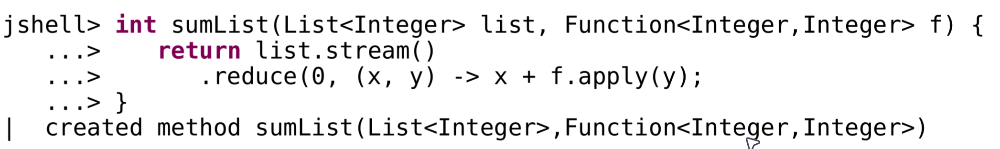
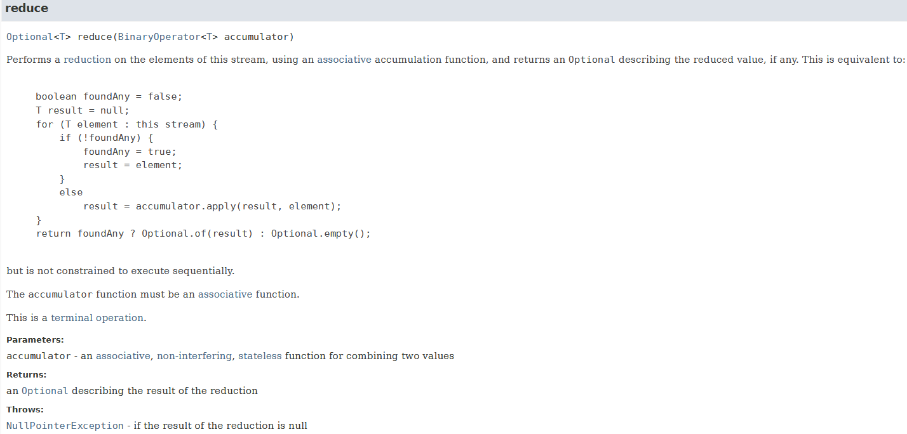
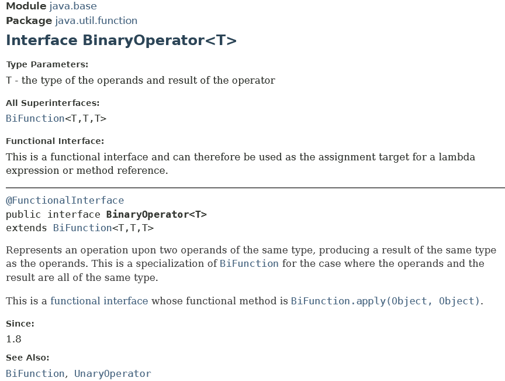
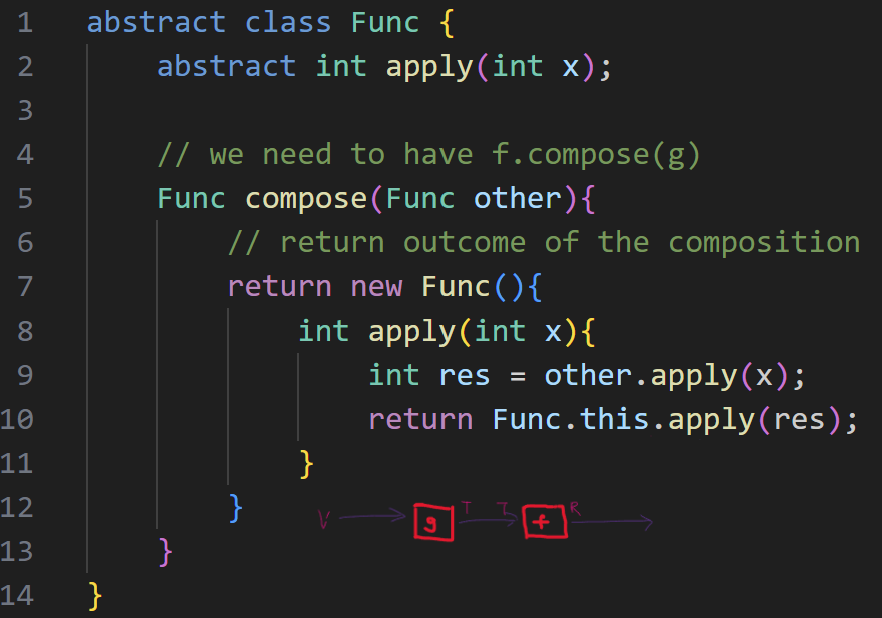

# Lecture 8 - Functional Programming
## Learning Outcomes
- what is a function and what are *pure functions*?
	- all the functions in the domain of mathematics are considered to be pure
	- in programming, we need to consider the state changes (i.e. impure functions)
- what are currying functions (i.e. functions with multiple arguments)
- what is closure and variable capture
- ability to perform function composition
	- how to delay execution until the entire function has been composed (using suppliers, apply and laziness)
## Function
- a function is a **mapping** of a set of values/elements to a set of outputs within a co-domain / range
	- every input in the domain has **exactly one output**
	- multiple inputs can be mapped to the same output (i.e. $-2^2$ and $2^2$ is 4)
	- not all values in the co-domain are mapped $\implies$ absolute function doesn't take into account negative integers

i.e. `x -> x | y` (for y $\ne$ 0)
- need to extend the co-domain to include the `y`-value of zero $\implies$ using of optionals when $y = 0$
- The aim is to **make the co-domain defined** such that the outcome of the mapping of every element will end up inside the co-domain

### Pure Functions
- takes in argument(s) and returns a *deterministic value* **every time** $\implies$ repetition has **no effect** on the output being different
	- return value is the same for the same set of values that it takes in
	- PRNGs are non-deterministic since they output different values each time

- must be **side-effect** free (i.e. running the function does not change anything outside of it). Some side effects include:
	- modifying *external state*
	- program input/output (rather the practice is to collect all the outputs via `toString()`)
	- throwing exceptions (refer to Week 9 Lecture) $\implies$ is a type of side-effect

**Absence of side-effects** is a necessary condition for *referential transparency*
- i.e. expressions can be replaced with their resulting values without changing the property of the program
#### Forecast
*Next Week: Lecture on Exception Handling*
- downstream module requires exception handling
- building of context that handles exception handling to remove side-effects of exception
	- Writing the `Try` class (which is an interface)

#### Exercise on Slide 5
Are these functions pure? Why or why not?

##### (a)
```java
int p(int x, int y) {
	return x + y;
}
```
- an integer overflow always results with the same number produced (is pure, but not correct/good practice]), $\therefore$ *(a) is pure*

##### (b)
```java
int q(int x, int y) {
	// if y is zero, then there is a side effect (exception)
	return x / y; 
}
```
- zero division exception is a side effect, $\therefore$ (b) is **not pure**

##### (c)
```java
// modify the list in place -> changing external state
void r(List<Integer> list, int i) {
	list.add(i);
}
```
- (c) is **not pure** as we are changing external state $\implies$ physically modifying the list itself and not returning a new object
	- if `List.<Integer>of(...)` / generic Immutable List was used, the function is also considered to be impure $\implies$ exception thrown for inability to modify Immutable List.

##### (d)
```java
int s(int i) {
	// class property modification
	return this.x + i;
}
```
- whether (d) is pure/not pure depends on whether the class containing it is pure

```java
class Container {
	private final int x;
	Container(int x){
		this.x = x;
	}
	
	...
	
	int s(int i) {
		// class property modification
		return this.x + i;
	}
	
	...
}
```
In the above scenario, the function `s` is pure because `x` is declared to be `private final` (i.e. immutable).

In other cases where `x` mutates over its lifespan, then it is not pure.

## Higher Order Functions
- we need HOF to support calling with args and functions, as well as to return functions (i.e. with lambdas)
- functions can be treated as a value based on their return type (that are passed into other functions).

Example of a Function taking in another function as its Input (i.e. a Higher-Order Function):
- takes in the list of elements, use the `apply()` method function to each element
- sum up the value using `reduce()`


```java
jshell> Function<Integer, Integer> f = x -> x + 1;
f ==> $Lambda/0x0000017f0100a200@4e1d422d

jshell> Function<Integer, Integer> g = x -> Math.abs(x) * 10;
g ==> $Lambda/0x0000017f0100a638@78c03f1f

jshell> f.apply(2)
$13 ==> 3

jshell> int sumtheList(List<Integer> list, Function<Integer, Integer> f) {
   ...>     return list.stream().reduce(0, (x, y) -> x + f.apply(y));
   ...> }
|  created method sumtheList(List<Integer>,Function<Integer, Integer>)

jshell> sumtheList(List.of(1, -2, 5), f)
$14 ==> 7

jshell> sumtheList(List.of(1, -2, 5), g)
$15 ==> 80
```
### Functions with multiple arguments -- the `reduce()` method
- `BinaryOperator<T>` is found in this method (taken in as an argument to `reduce()`)
	- `Stream`'s `reduce()` takes  in a `BinaryOperator` $\to$ the reduction has to be done with a seed that is of the **same type** as the stream's values
	

- The `BinaryOperator<T>` takes in type `T` and returns type `T` $\implies$ is quite restrictive

- `BinaryOperator` is a sub-interface of `BiFunction` (a general interface)
	- `BiFunction<T, U, R>` takes in two input (T and U) and give out one input (R)

	
### Curried Functions
- functions to deal with having *multiple arguments* (which can have multiple nested functions within)
- no need for tri- or quad-functions since we can utilize function currying
	- can use `f.apply(1).apply("string")`
		- `f.apply(1)` is called a *partial application*, while `f.apply(1).apply("2")` will "run" all the things within the intended outer function

- "piggy-bagging" arguments
	- one of the arguments is a function

```java
// instantiating a Binary Function
jshell> BiFunction<Integer, String, Integer> bifun = (i, s) -> i + s.length()
bifun ==> $Lambda/0x0000028a3500a200@66480dd7

jshell> bifun.apply(10, "hello")
$2 ==> 15

// same functionality as the BiFunction, but using Function Currying
jshell> Function<Integer, Function<String, Integer>> curriedFunc = i -> (s -> i + s.length())
curriedFunc ==> $Lambda/0x0000028a3500a828@4fe3c938

// first step gives out another function (i.e. Function<String, Integer>)
jshell> curriedFunc.apply(10)
$4 ==> $Lambda/0x0000028a3500ac60@71423665

jshell> curriedFunc.apply(10).apply("hello")
$5 ==> 15
```

- Writing the types is cumbersome, otherwise currying is a neat way to take in functions as arguments.

#### Curried Functions / Partial Application - under the hood
- can create functions (specifically HOFs) using the *anonymous inner class way* or using *lambdas* (the inner class is an implementation of the Function interface)

The lambda method is as follows
```java
f = x -> y -> x + y;
```

and its corresponding anonymous inner class method:
- needs to have the `apply()` abstract method since it is an implementation of the `Function<T, R>` interface $\implies$ **returns a `Function<Integer, Integer>`** (i.e. the return type)
```java
Function<Integer, Function<Integer,Integer>> f = new Function<>() {
	@Override
	public Function<Integer,Integer> apply(Integer x) {
	
		return new Function<Integer,Integer>() {
			@Override
			 
			// the inner class has its own apply method -> takes in integer,
			// gives out another integer
			public Integer apply(Integer y) {
				return x + y;
			}
		};
	}
}
```


```java
func = x -> y -> x + y
```

- `x` is scoped in the "outside" `.apply()` two layers up
	- we are creating a **method inside a method**
	- the `x` is kind of "crossing boundaries", it is defined in the outer function but crosses into the inner function
		- `x` is defined in the scope of the outer `apply()` function, but used in the inner `apply()` function itself.

- the outer function declared with `f = new Function<>(){...}` is an instance of a local class
	- we are instantiating a local class that implements the Function interface

### Closures
> *def:* An instance of a local class is returned as a **closure** (is nothing more than an **object** in the realm of functional programming)
- returning an *instance of a local class* (a.k.a. closure), in this case its returning Predicate

```java
import java.util.function.Predicate;
class A {
    private final int z;
  
    A(int z) {
        this.z = z;
    }

	// this is the local class
    Predicate<Integer> foo(int y) {
        // is the same as writing "return x -> x == y + z;"
        return new Predicate<Integer>() {
            @Override
            public boolean test(Integer x) {
                return x == y + z; // can obtain these values
            }
        };
    }
}
```

```java
Predicate<Integer> pred = new A(1).foo(2);
```

`Predicate.test()` enclosed within Predicate method `foo()`, the expression `x == y + z`
- knows the variables of its enclosing method (i.e. `y`)

`Predicate.test()` enclosed within class `A`, the expression `x == y + z`
- knows the properties of the enclosing class (i.e. `this.z`)

The expression  `x == y + z`is closed on its enclosing methods and the "stuff" in its enclosing stuff (typically only the variables)

```java
x -> x = y + z // from where one???
```
- `y` and `z` are determined by methods or classes *enclosing the local class*
	- obtained from external constructs (i.e. was already set somewhere else, which may not be known)

- we have moved away from standalone lambdas to lambdas which depend on certain values

- may be good to have anonymous inner classes (allows one to see where the variables have come from)
### Variable Capture
- in order for the `y` value to be known, the local class has to make a copy of the value `y` (i.e. variables of the enclosing method)

- captures the reference of the enclosing class
	- value of `y` is captured
```java
Predicate p1 = new A(1).foo(2)
```

- The reference is called `A.this()` $\implies$ using a qualified list (i.e. to reference the `z` initialized in class A, we use `A.this.z`).
	- this is particularly useful when writing anonymous inner classes

- Java only allows local classes to capture variables that are **explicitly declared as `final` or effectively final**
	- cannot change the variable's value elsewhere (see Recitation)

## Composing Functions
- using the `compose()` method
	- $g \circ f \: \to$ `g.compose(f).apply(...)` [doing g first then doing f]
- alternative composition that is **more natural** using `andThen()` $\implies$ don't need to worry which one comes first
	- apply through `f` first, `andThen(g)` $\to$ `f.andThen(g).apply(...)`

- there are defined methods in the interface (Java interfaces are impure)
	- using `default` $\implies$ legacy compatibility issues

- somewhat similar to how streams can be "chained together" to form a pipeline

### Under the Hood: Composition of Functions
What actually happens to compose and how do we define the `compose()` method?
- function needs to be an **abstract** class $\implies$ because we don't want to write default methods

```java
jshell> abstract class Func {
   ...>     abstract int apply(int x);
   ...> }
|  created class Func

jshell> Func f = new Func() {
   ...>     int apply(int x) {
   ...>         return x + 2;
   ...>     }
   ...> }
f ==> 1@6d7b4f4c

jshell> Func g = new Func() {
   ...>     int apply(int x) {
   ...>         return x * 2;
   ...>     }
   ...> }
g ==> 1@3108bc

jshell>
```

We then modify `Func` to be the following:

- need to use `Func.this.apply()` to access the `abstract int apply()`
```java
jshell> f.compose(g)
$6 ==> Func$1@5abca1e0

jshell> f.compose(g).apply(2)
$7 ==> 6
```

We need the closure with all the appropriate variable captures for composition to be successful.

The `andThen()` implementation looks quite similar to compose, just the ordering of which operation we do first (i.e. the `.apply()` method)

```java
Func andThen(Func other) {

	return new Func() {
		int apply(int x){
		int res = Func.this.apply(x);
			return other.apply(res);
		}
	};
}
```

After changing the class to accept generics:
```java
jshell> Func<Integer, Integer> f = new Func<Integer, Integer>() {
   ...>     Integer apply(Integer x) {
   ...>         return x + 2;
   ...>     }
   ...> }
f ==> 1@c8c12ac

jshell> Func<Integer, Integer> g = new Func<Integer, Integer>() {
   ...>     Integer apply(Integer x) {
   ...>         return x * 2;
   ...>     }
   ...> }
g ==> 1@223191a6

jshell> g.andThen(f).apply(2)
$24 ==> 6
```
### Lazy Evaluation with Function Composition
- Streams itself is lazily evaluated (but we can use methods to force out the value) $\implies$ terminal operator forces out the value
	- `reduce()` or other **terminal operations** allows for the **stream to be evaluated** and enables one to obtain the result
	- using `apply()` also enables the function to be evaluated

- function composition is associative

#### Delayed Applications
Study the stream pipeline below:
```java
jshell> Stream.<String>of("one", "two", "three").
   ...> map(x -> x.length()).
   ...> reduce(0, (x, y) -> x + y)
$1 ==> 11
```

- to compose functions for *delayed applications*, we need to:
	1. `map()` each string `x` to `Function<Integer, Integer>`
	2. perform a reduction using reduce with an identity function of the type `Function<Integer, Integer>`

```java
jshell> Function<String, Function<Integer, Integer>> mapper = x -> y -> x.length() + y
mapper ==> $Lambda/0x000001928300a878@5383967b

jshell> Function<Integer, Integer> delayed = Stream.<String>of("one", "two", "three").
   ...> map(mapper).
   ...> reduce(Function.<Integer>identity(), (x, y) -> x.andThen(y))
delayed ==> java.util.function.Function$$Lambda/0x000001928305b058@2286778

jshell> delayed.apply(0)
$4 ==> 11
```
- in this case, we employ lazy evaluation of the method / lambda called `delayed`.

**What should we do in this case?**
- we should map `x` to a function that can assist with addition later on
```java
jshell> Stream.<String>of("one", "two", "three").
   ...> map(x -> x.length())
$1 ==> java.util.stream.ReferencePipeline$3@a67c67e

jshell> Stream.<String>of("one", "two", "three").
   ...> map(x -> y -> x.length() + y)
|  Error:
|  incompatible types: cannot infer type-variable(s) R
|      (argument mismatch; bad return type in lambda expression
|        java.lang.Object is not a functional interface)
|  Stream.<String>of("one", "two", "three").
|  ^----------------------------------------...
```

### Identity Function
i.e. `x -> x` (but can't do like this because cannot reconcile types)
- can use an identity method

![[Pasted image 20241007132928.png]]

