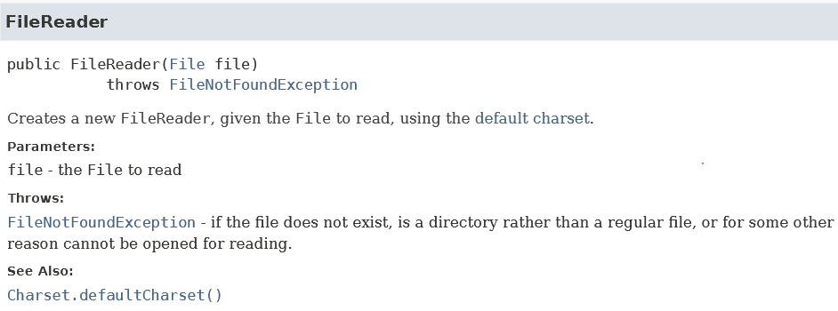
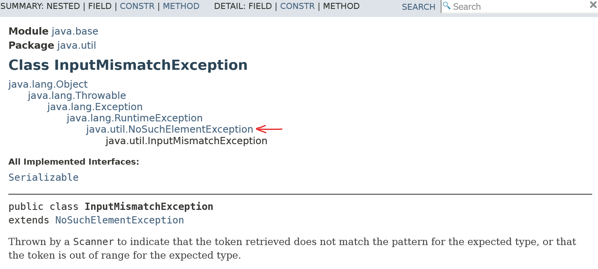
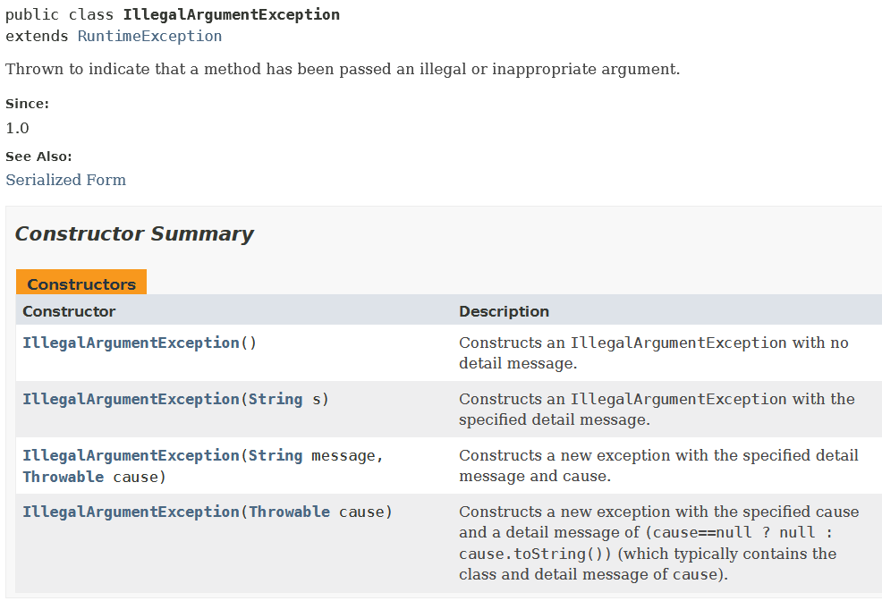
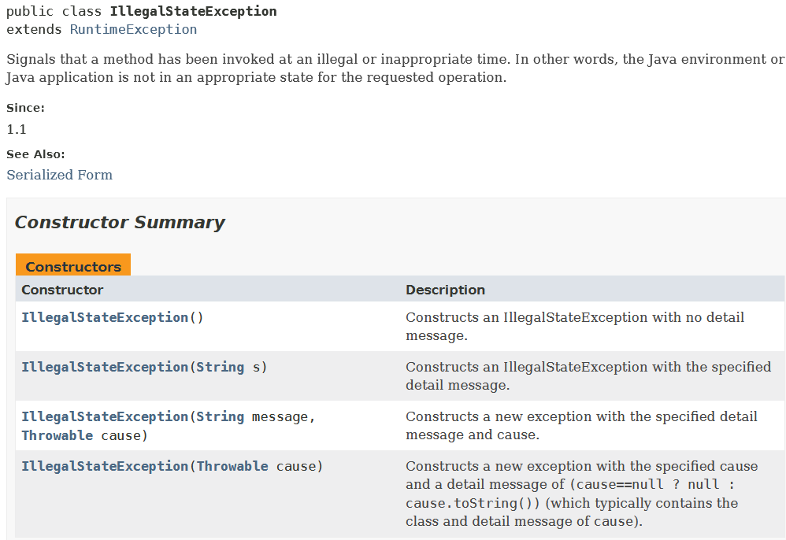

# Week 9 Lecture -- Exception Handling & Functor and Monad Laws
## Try Context
- similar to an Optional or a "Maybe" context
- intended for the purpose of **exception handling**

## Imports
- `FileNotFoundException` must be explicitly managed
	- if java sees that it is not managed, the code will not compile
	- `FileReader` $\implies$ throws exceptions even before file is opened
	
- when give a bomb, we should elegantly diffuse it

## Motivation for Exception Handling
In *Level 5 of Lab04*, we have used `new Scanner()` to read input
```java
import java.util.Scanner;

class Main {
    public static void main(String[] args) {
        Scanner sc = new Scanner(System.in); // operating on std input stream

        int numLines = sc.nextInt();
        Roster rst = new Roster("AY24/25");
        ...
    }
}
```

In this instance, we will use `FileReader` to **read the file**
```java
public static void main(String[] args) {
    FileReader file = new FileReader(args[0]);
    List<Point> points =
        new Scanner(file)
            .useDelimiter("\n")
            .tokens()    // Stream<String>
            .map(str -> new Scanner(str))
            .map(sc -> new Point(sc.nextDouble(), sc.nextDouble()))
            .toList();
	...
}
```

### Ways to handle `FileNotFoundException`
- `FileReader` requires us to **explicitly manage exceptions**
	

- identify the exception surfaces ("Where in the code where the bomb might show up?")
	- We identify that **`FileReader`** exists below the `static void main()`
	- We state that `static void main() throws FileNotFoundException`

- `FileNotFoundException` is an object, which we can name

- the errors can potentially be caught using the `catch` keyword
	- have to **catch specific exceptions** 

We have resolved some of the exceptions by catching them.
- we also use `finally{ ... }` to do housekeeping
```java
// imports
import java.io.FileReader;
import java.util.Scanner;
import java.io.FileNotFoundException;
import java.lang.ArrayIndexOutOfBoundsException;
import java.util.InputMismatchException;
import java.util.NoSuchElementException;


class Main {
	public static void main(String[] args) throws FileNotFoundException {
		try {
			FileReader file = new FileReader(args[0]);
            List<Point> points =
                new Scanner(file)
                    .useDelimiter("\n")
                    .tokens()    // Stream<String>
                    .map(str -> new Scanner(str))
                    .map(sc -> new Point(sc.nextDouble(), sc.nextDouble()))
                    .toList();
            DiscCoverage maxCoverage = new DiscCoverage(points);
            System.out.println(maxCoverage);
		}
		catch (FileNotFoundException ex){
			// using stderr
			System.err.println("File Not Found!");
		}
		catch (ArrayIndexOutOfBoundsException ex){
			System.err.println("Missing Filename");
		}
	
		// types of input is not what was expected
		catch (InputMismatchException ex){
		System.err.println("Input is not a number");
		}
		
		catch (NoSuchElementException ex){
			System.err.println("No element");
		}
	
		// do something else (will always happen rgdless of exception)
		finally {
			System.out.println("Finish");
		}
	}
}
```

We run the `Main.java` as "`java Main data.in`"
- with `data.in` file as a required argument

### Runtime exceptions
- compiler doesn't check for these, so will only surface upon running the program
### try-catch
- `try` can be thought of as a sandbox context for exception handling
- allows us to **separate the main business logic** from the exception handling ( so that don't have to use lots of `if-else`s or conditionals to look out for edge cases and exceptions / the bombs)

## Handling Exceptions
### Method 1: `throws` the exception out of the method
- As much as possible, try **not** to throw the exception out of the method
- using the following:
```java
public static void main(String[] args) throws FileNotFoundException { ... }
```

### Method 2: Handle the exception within the method
- the preferred way, so that clients will continue using the application

- missing data / data format not correct $\implies$ will be caught by `NoSuchElement` but not `InputMismatchException` if `NoSuchElement` precedes the latter
	

- We need to catch specific Exceptions first (make sure we don't have a more general exception / parent exception class that covers the more specific one)

---
## Throwing Exceptions (not catching exception)
- explicitly **creating the exception**, using the `throw` keyword
### `throw` versus `throws`
- `throws` $\implies$ take the exception and throw it out / handle  it
- `throw` $\implies$ otherwise (other than this case)

### Useful exceptions
- if the arguments of a method are not right, we can throw the `IllegalArgumentException` (i.e. a form of input handling / validation of sorts)

	

- we also can use the `IllegalStateException` when we are not supposed to have Objects be in a certain state

	

- try to use an existing exception rather than create a new one (from the *Java 21 API*)
	- can create one's own exception method if required(but in rare cases)
```java
class IllegalAnimalException extends IllegalArgumentException {
	IllegalAnimalException(String message) {
		super(message);
	}

	...

	@Override
	public String toString() {
		return "IllegalAnimalException: " + getMessage();
	}
}
```

### Exception versus Normal Control Flow
The diagram below looks at normal behaviour (which is expected, but requires checks), versus one with exceptions.


- Exception is just thrown, and **breaks the program flow**.

- use the **logical `or` operator** or pipe (i.e. $| \:$) to combine the exceptions together
	- `catch (FileNotFoundException | ArrayIndexOutOfBoundsException ex)

### Types of Exceptions
1. Checked exception
	1. should be caught using `catch` or propagated using the `throw` keyword
	2. the compiler requires **explicit handling** or throwing.
	3. i.e. `FileNotFoundException`
	
2. Unchecked exception (the more usual one)
	1. Runtime Exceptions, which are unexpected
	2. Usually a result of a bug in the program
		1. i.e. `ArithmeticException` $\implies$ division by zero

When overriding a method that throws a checked exception, the overriding method **cannot throw a more general exception**.
- should **not** use `throw` in place of `return` in methods (returning one value type instead of different context types of Exception) $\implies$ we should **NOT** expect a function to return different types (go back to properties of a function or 1:1 mapping)
- goes back to Liskov's Substitution Principle (for exception handling)
	- The overriding method cannot be more general (or in this case, cannot throw an exception that is more general) than the one being overriden

- catch separate exceptions using specific contexts, don't catch them all!
	- Pokemon exception handling is **bad**.

- the place you create the bomb is the place you catch it (i.e. throw and catch should be within the same method)

## Try generic interface
- Fail and Success static methods return `Try<T>`
- `Try` can have two implementors (of itself), Success and Failure (but cannot because of cyclic dependency in the `of()` method)
	- can instead implement as Success and Failure local classes

```java
jshell> Try.<Integer>of(() -> 1)
$4 ==> Success: 1

jshell> Try.<Integer>of(() -> 1).orElse(2)
$5 ==> 1

jshell> Try.<Integer>of(() -> 1/0).orElse(2)
$6 ==> 2

// is using the "failure" Try object
jshell> Try.<Integer>of(() -> 1/0)
$7 ==> Failure: java.lang.ArithmeticException: / by zero
```

We can have static methods within an interface itself.
- reason being, we don't use properties or anything, but we simply **call the method**
```java
static <T> Try<T> of(Supplier<? extends T> supplier) {
	try {
		return succ(supplier.get());
	} catch (Exception ex) {
		return fail(ex);
	}
}
```

- Java exceptions are side effects that break the pipeline
	- We can encapsulate the success and failure scenarios (via local inner classes) within the `Try` context with some properties
		1. exceptions **caught within the context** itself and non-verbose message produced
		2. exception message **propagated through pipeline**

		```java
		jshell> Try.of(() -> 1).map(x -> x / 0).map(x -> x + 2)
		$.. ==> Failure: java.lang.ArithmeticException: / by zero
		```

		3.  Value returned if *no exception*, otherwise a **default value** (through the `orElse()` and `orElseGet()` methods)
### Variable capture
- capturing the original value 
- inner classes methods **need to be of `public` access**

### `.map()` method
- map an identity function over `R`
	- identity function replaces `.map(val -> val)` $\implies$ reflexive property

```java
return mapper.apply(t).map(Function.<R>identity());
```

- bottom line $\implies$ we **do not expose our exceptions** to our client at all
	- all the client sees is the success or failure `Try` objects

---
## Laws of Functor and Monad
- can make use of side effects, but we need to encapsulate them into contexts $\implies$ contexts become pure values
	- contexts that handle side-effects need to obey the functor and monad laws

- monad enables the pipelining implementations to be abstracted by wrapping a value in a type.
	- allows code to be imperative instead of declarative (declare what you want to do, while not having to catch stuff)

### Functor & Monad
- a functor is a way that we look at the `map()` method (we can think of a functor as a context)
	- can think of a functor as a generic interface `Functor<T>`, but yet this does not exist as an interface in Java.

- The use of a functor (i.e. `map()`) can be a way to manipulate a value **within the context** without logging for example.

### Functor Laws
1. **Identity Law:** any mapping with an identity function should return you with the same value
	1. for each context, if we apply a identity function, we **get the same value back** (the same behaviour, so it is predictable)
		$functor.map(x \to x) \iff functor$

2. **Associative Law**: because function compositions are associative
	1. context with two separate functions, can apply the composition of $g \circ f$
		$functor.map(f).map(g) \iff functor.map(g.compose(f)) \iff functor.map(x \to g.apply(f.apply(x)))$
		- in the above case, we assume that $f$ and $g$ are pure functions.

```java
jshell> Try<Integer> f = Try.<Integer>of(() -> 1);
f ==> Success: 1

jshell> Function<Integer, Integer> g = x-> x * 2;
g ==> $Lambda/0x00000161ac00bca8@4e9ba398

jshell> Function<Integer, Integer> h = x-> x + 3;
h ==> $Lambda/0x00000161ac00c000@527740a2

jshell> f.map(g).map(h)
$14 ==> Success: 5

jshell> f.map(h.compose(g)) // $14 is the same operation
$15 ==> Success: 5

jshell> f.map(h).map(g)
$16 ==> Success: 8
```

### Monad Laws
1. **Identity Law:** identity within a context (identity cannot be just `x -> x`, because `flatMap()` must take in `x -> Try.of(...)`)
	1. takes in a identity of `x` wrapped in a `Try` context
	2. Right identity Law: $f \cdot id \equiv f \implies$ `f.flatMap(id)` returns type `F` 
	3. Left Identity Law: $id \cdot f \equiv f \implies$ `id.apply(<value>).flatMap(g)` which is the same as `g.apply(value)` 

```java
jshell> Function<Integer, Try<Integer>> monadId = x -> Try.of(() -> x);
monadId ==> $Lambda/0x00000161ac00e200@185d8b6

jshell> monadId.apply(1)
$18 ==> Success: 1

jshell> f.flatMap(monadId)
$19 ==> Success: 1
```

2.  **Associative Law:** 
	1. Somewhat similar to the associative law of functors as above.
		$monad.flatMap(f).flatMap(g) \iff monad.map(g.compose(f)) \iff monad.map(x \to f.apply(x).flatMap(g)))$
- Apply the composed function back to the map of `x`


```java
jshell> Function<Integer, Try<Integer>> ff = x -> Try.of(() -> x * 3)
ff ==> $Lambda/0x00000161ac00ee58@3b0143d3

jshell> monadId.apply(5).flatMap(ff)
$22 ==> Success: 15

jshell> ff.apply(5)
$23 ==> Success: 15

jshell> Function<Integer, Try<Integer>> gg = x -> Try.of(() -> x * 2)
gg ==> $Lambda/0x00000161ac00f8b0@7d907bac

jshell> f.flatMap(gg).flatMap(ff)
$25 ==> Success: 6

jshell> f.flatMap(x -> gg.apply(x).flatMap(ff)) // same as the above
$26 ==> Success: 6
```