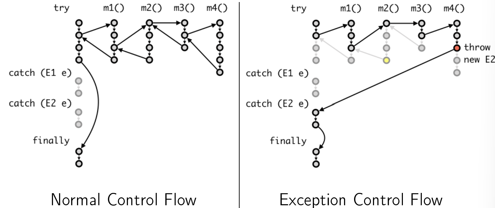

# Week 9 Lecture
## Try Context
- similar to an Optional or a "Maybe" context
- intended for the purpose of exception handling

## Imports
- `FileNotFoundException` must be explicitly managed
	- if java sees that it is not managed, the code will not compile
	- `FileReader` $\implies$ throws exceptions even before file is opened
	
- when give a bomb, we should elegantly diffuse it

### Ways to handle `FileNotFoundException`
- identify the exception surfaces ("Where in the code where the bomb might show up?")
	- We identify that `FileReader` exists below the `static void main()`
	- We state that `static void main() throws FileNotFoundException`

- the errors can potentially be caught using the `catch` keyword
	- have to **catch specific exceptions** 

```java
// imports
import java.io.FileNotFoundException;
import java.lang.ArrayIndexOutOfBoundsException;
import java.util.InputMismatchException;
import java.util.NoSuchElementException;


class Main {
	public static void main(String[] args) throws FileNotFoundException {
		try {
			FileReader file = new FileReader(args[0]);
            List<Point> points =
                new Scanner(file)
                    .useDelimiter("\n")
                    .tokens()    // Stream<String>
                    .map(str -> new Scanner(str))
                    .map(sc -> new Point(sc.nextDouble(), sc.nextDouble()))
                    .toList();
            DiscCoverage maxCoverage = new DiscCoverage(points);
            System.out.println(maxCoverage);
		}
		catch (FileNotFoundException ex){
			System.err.println("File Not Found!");
		}
		catch (ArrayIndexOutOfBoundsException ex){
			System.err.println("Missing Filename");
		}
		catch (InputMismatchException ex){
		System.err.println("Input is not a number");
		}
		catch (NoSuchElementException ex){
			System.err.println("No element");
		}
	
		// do something else (will always happen)
		finally {
			System.out.println("Finish");
		}
	}
}
```

We run the `Main.java` as "`java Main data.in`"
- with `data.in` file as an argument

### try-catch
- allows us to separate the main business logic from the exception handling (don't have to use lots of `if`s to look out for edge cases and exceptions)
- the code in the `try` catch is called the  ???

## Handling Exceptions
- missing data / data format not correct $\implies$ will be caught by `NoSuchElement` but not `InputMismatchException`

As much as possible, try not to throw the exception out of the method

- use the `or` operator to combine the exceptions together
	- `catch (FileNotFoundException | ArrayIndexOutOfBoundsException ex)

### `throw` versus `throws`
- `throws` $\implies$ take the exception and throw it out (in the main method itself)
- `throw` $\implies$ otherwise (other than this case)

- try to use an existing exception rather than create a new one



- Exception is just thrown, and breaks program flow.


### Types of Exceptions
1. Checked exception
	1. should be caught or propagated using the `throw` keyword
2. Unchecked exception
	1. Runtime Exceptions, unexpected

When overriding a method that throws a checked exception, the overriding method cannot throw a more general exception.
- should not use `throw` in place of `return` in methods(returning one value type instead of different context types of Exception)


The overriding method cannot be more generic type than the one being overriden

- catch separate exceptions using specific contexts, don't catch them all!
	- Pokemon exception handling is bad.

- the place you create the bomb is the place you catch it (i.e. throw and catch should be within the same method)

## Try generic interface
- Fail and Success static methods return `Try<T>`
- `Try` can have two implementors, Success and Failure (but cannot because of cyclic dependency in the `of()` method)
	- can instead implement as Success and Failure local classes

### Variable capture
- capturing the original value 


interface methods need to be of `public` access

### `.map()` method
- map an identity function over `R`
	- identity function replaces `.map(val -> val)` $\implies$ reflexive property

```java
return mapper.apply(t).map(Function.<R>identity())
```


## Laws of Functor and Monad
- can make use of side effects, but we need to encapsulate them into contexts $\implies$ contexts become pure values

- a functor is a context that we look at the `map()` method
- a monad is a context that ... the `flatMap()` method

### Functor Laws
1. **Identity Law:** any mapping with an identity function should return you with the same value
2. **Associative Law**: because function are associative

### Monad Laws
1. **Identity Law:** identity within a context
	1. Right identity Law: $f \cdot id \equiv f \implies$ `f.flatMap(id)` returns type `F` 
	2. Left Identity Law: $id \cdot f \equiv f \implies$ `id.apply(<value>).flatMap(g)` which is the same as `g.apply(value)` 

2. **Associative Law:** 
	1. 

Apply the composed function back to the map of `x`


